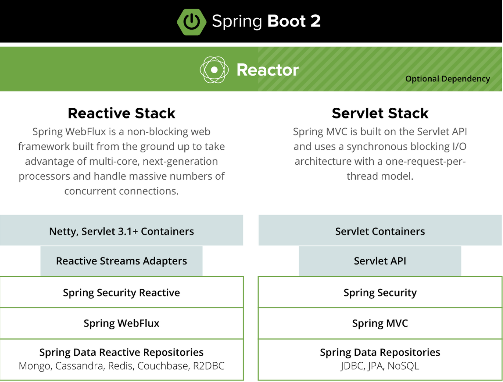

## Spring WebMVC

- Spring WebMVC는 Servlet API를 기반으로 구축된 웹 프레임워크이다.
- Servlet은 요청-응답 기반의 동기적인 웹 프로그래밍 모델을 기반으로 하며 클라이언트 요청을 받아 처리하고, 응답을 반환하는 동기적인 통신 방식이다.
- WebMVC는 이름에서 알 수 있듯이 MVC 디자인패턴을 사용하도록 되어있다.
- 동기적인 방식으로 작동하며, 블로킹 IO 방식을 사용
    - **블로킹 IO란?**
        
        블로킹 IO 방식은 클라이언트로부터 요청이 발생한 시점부터 서버가 이를 처리하고 클라이언트에게 응답을 주기 전까지 대기하는 구조이다. 하나의 쓰레드가 클라이언트의 요청을 처리하는 동안에는 다른 서비스를 수행할 수 없는 블로킹상태가 된다.
        
    - **동작 방식**
        
        Dispatcher Servlet을 통해 Controller로 전달되며 이 때 동시 접속을 위한 사용자의 수만큼 쓰레드를 생성해 각각의 쓰레드가 요청이 완료될 때까지 점유 되어있는 상태로 존재하며 클라이언트에게 요청에 대한 응답을 돌려줄 때 Tomcat의 Thread Pool를 이용하여 해당 쓰레드가 다시 가용한 상태로 전환되는 방식
        

### 장점

- 가장 오래된 전통적인 방식으로 안정성이 높다.
- 전통적인 프로그래밍 방식으로 개발을 하기에 배우기 쉽고 개발 생산성이 높다.
- 다양한 라이브러리와 도구들이 Spring WebMVC와 호환되어 방대한 생태계와 문서가 있다.
- JPA와 같은 ORM 프레임워크와의 통합이 용이하며, 트랜잭션 관리가 편리하다.

### 단점

- 각 요청마다 쓰레드를 할당하기 때문에, 많은 요청이 동시에 들어오면 많은 부하가 발생하고 쓰레드 풀이 고갈될 수 있다.
- 동기식 I/O로 인해, 외부 서비스와의 통신에서 대기 시간이 발생하면 전체 성능에 영향을 미칠 수 있다.

## Spring WebFlux

- Spring WebFlux는 Spring 5에서 새롭게 도입된 Reactive Streams API를 기반으로 구축된 비동기적 웹 프레임워크이다.
- Spring 5는 Spring Boot 2부터 도입이 되었으며, 이로 인해 Spring Boot 2부터는 Reactive Stack과 Servlet Stack 2가지가 존재
- 비동기적인 방식으로 작동하며, 논 블로킹 IO 방식을 사용
    - **논 블로킹 IO란?**
        
        논 블로킹 IO 방식은 클라이언트로부터 요청을 전달받은 뒤 대기하지 않고 다른 처리를 수행하는 구조로 하나의 쓰레드가 많은 각 작업을 굉장히 적은 시간으로 쪼개어 하나씩 수행하도록 하는 방법이다. 이를 이벤트 루프 방식이라고도 한다.
        
    - **동작 방식**
        
        동시 접속하는 사용자의 수만큼 쓰레드를 생성하지 않는다. 하나의 요청을 받은 쓰레드가 해당 요청에 대한 결과를 리턴하는 과정에서 다른 작업도 함께 수행할 수 있기 때문에 다수의 쓰레드 풀을 생성할 필요가 없다.
        
        **주의:** 하나의 쓰레드가 다수의 작업을 수행할 수 있기에 적은 쓰레드로 다수의 작업을 수행할 수 있다는 것이지 WebFlux가 모든 요청에 대해 싱글 쓰레드로 작동한다는 것은 아니다.
        
- Reactive Streams의 구현체 중 하나인 Reactor를 기반으로 개발
- Reactor는 Pub-Sub 패턴을 기반으로 하여 데이터가 생성되는 시점과 데이터가 소비되는 시점을 분리, 비동기적으로 처리할 수 있다.
- 대규모 트래픽이 발생할 경우 효율적인 리소스 관리와 적은 쓰레드로도 높은 처리량을 보장할 수 있다.
- **탄생 배경**
    
    웹 서비스아키텍처 구축 시 더 적은 자원으로 더 빠르게 서비스를 제공하려는 수요가 늘어나기 시작했다. 이에 Node.js에서는 먼저 이벤트 루프를 활용한 논 블로킹 IO를 선보이면서 웹 서비스 아키텍처에 새로운 패러다임이 제시되었다. 이러한 Node.js의 성공을 통해 자바 진영에서도 논블로킹 IO 모델에 대한 필요성이 꾸준히 제기되었고, Spring 5부터 WebFlux라는 이름의 리액티브 라이브러리를 제공
    

### 장점

- 많은 트래픽과 높은 동시성을 필요로 하는 애플리케이션에서 우수한 성능과 효율성을 발휘한다.
- 요청마다 쓰레드를 할당하지 않기 때문에, 더 적은 리소스로 더 많은 요청을 처리할 수 있어 효율적인 리소스 사용이 가능하다.
- 효율적인 리소스 사용으로 시스템에 훨씬 적은 부하가 발생하고, Context-Switching도 현저히 줄어든다.
- Backpressure의 지원으로, 시스템의 오버로드를 방지하고 자원을 효율적으로 활용할 수 있다.
    - **Backpressure란?**
        
        들어오는 수많은 데이터를 적절하게 제어해서 과부하가 발생하지 않도록 하는 수단
        
- 특히, MSA환경에서 논 블로킹 방식으로 인해 WebFlux는 높은 성능을 발휘할 수 있다.
    - 이러한 점으로 인해, Spring Cloud Gateway에서는 기본적으로 WebFlux를 사용하는 듯 함(?)
    - WebMVC의 문제점
        - 각 서비스간 정보 교환을 위한 통신에서 Blocking 시간이 길어지면 응답을 기다리는데 쓰레드를 모두 소진할 수도 있다.
        - 타임아웃이 발생할 정도의 지연이 발생하면 다른 모듈에도 영향을 주어 전체 시스템이 다운될 수 있다.

### 단점

- 일반적인 프로그래밍 방식과 달리 학습 곡선이 높고, 이로 인해 개발 생산성이 떨어진다.
- 코드가 복잡해지고 가독성이 떨어져 디버깅이 어려울 수 있다.
    - 위와 같은 단점들은 Kotlin을 사용하는 환경(일명, 코프링)에서는 WebFlux 사용시 기본적으로 Coroutine을 사용할 수 있어 상당 부분 해결 가능
    - 물론, Backpressure와 같이 Reactor에서 제공하는 다양한 기능들이 있기에 Reactor를 같이 알아두는 것이 좋다.
- 리액티브 방식을 제공하는 라이브러리들이 매우 제한적이어서 호환성이 떨어질 수 있다.

## 비교

### 공통점

- 둘 다 어노테이션 기반의 프로그래밍 모델로 Spring에서 제공하는 대부분의 어노테이션을 그대로 사용할 수 있다.
- Spring Security, Spring Data 등 다른 Spring 생태계와의 호환성 유지
- 의존성 주입(DI), AOP, 서비스 추상화 등 핵심 스프링 프레임워크 기능 제공
- 둘 다 Servlet을 중요한 역할로 사용하고 HTTP 요청을 처리하고 응답을 생성한다.
    - Servlet 3.0은 Async Servlet 기능을 지원하며, 이를 통해 비동기적인 요청 처리를 할 수 있다.

### 차이점

- WebMVC는 JPA와 같은 훌륭한 ORM기반 기술을 사용할 수 있다.
- WebFlux는 Tomcat 뿐만 아니라 Netty 서버에서도 실행할 수 있다.(기본적으로 Netty 기반으로 동작)

## Tomcat VS Netty

### Tomcat

- Tomcat은 NIO Connector를 통해 사용자의 요청을 받는다.(Tomcat 9 버전 부터 NIO Connector를 기본으로 사용)
    - NIO Connector에서는 Acceptor를 통해 소켓을 수신하고 이를 PollerEvent Queue에 Publish 한다. Poller는 해당 Event Queue의 소켓을 구독하고 있어 획득하고, Channel들을 Processing 한다. 각 Channel들은 모두 Worker Thread에 할당되어 작업이 진행되며 이후는 CoyoteAdapter 로직을 통해 Servlet에 Dispatch하는 작업이 진행된다.
- Tomcat의 표준 HTTP Connector(NIO 등)에는 몇가지 속성을 지원
    - **MaxConnections**
        
        서버가 요청을 처리할 수있는 Connection의 수를 의미(기본값은 8192)
        
    - **AcceptCount**
        
        Connection수가 MaxConnection에 도달했을 경우 추가적인 Connection 요청을 대기시키는 공간(기본값은 100, 자료구조는 Queue)
        
    - **MaxThread**
        
        요청을 처리하는 쓰레드의 최대 수이다. 처리될 수 있는 동시 요청의 최대 수를 결정(기본값은 200)
        
- Tomcat은 들어오는 각 요청에 쓰레드를 할당하는 Thread Per Request 모델로 동작
- **기본 동작 방식**
    
    Tomcat은 기본적으로 8192개의 connection을 처리할 수 있다. 이때 Thread pool에서 가능한 요청 처리 Thread가 모두 작업 중일때(기본 200) 8192개 이후의 요청들은 모두 요청을 대기시키는 Queue로 이동하게 된다. 해당 Queue는 100개 까지의 요청을 더 대기시킬 수 있으며, 이후의 요청에 대해서는 timeOut 등의 처리가 이루어진다.
    

### Netty

- 비동기 이벤트 기반 네트워크 응용프로그램 프레임워크
- Netty는 비동기 처리를 지향하여, 요청을 보낸 뒤 즉시 반환한 다음 다른 작업을 하다 요청한 작업의 처리가 완료되면 나중에 응답 받는 방식
- 적은 수의 쓰레드로 많은 연결을 모니터링 할 수 있다.
- 호출되면 작업이 완료될 떄까지 쓰레드가 멈추는 블로킹 방식과 하나의 스레드로 여러 클라이언트를 대응하는 논 블로킹 소켓을 모두 지원
- HTTP 방식을 소켓에 적용한 모델로 Netty는 추상화 방식을 지원하기 때문에 소켓 모드를 바꾸어도 데이터 송수신 부분의 로직을 변경하지 않도록 작성할 수 있다.

### 차이점

- Netty는 이벤트 기반의 비동기 네트워크 프레임워크로 클라이언트의 요청을 비동기로 처리하여 적은 스레드로 높은 성능을 제공한다.
Tomcat은 전통적인 서블릿 기반의 웹 어플리케이션 서버(WAS)로, 클라이언트 요청을 처리하기 위해 스레드 풀을 사용한다.
- Netty는 비동기 방식의 클라이언트 요청을 처리하기 위해 멀티 코어를 활용하여 수십만 개의 동시 연결을 처리할 수 있다.
Tomcat은 대규모 웹 어플리케이션을 처리하기 최적화되어 있어 일반적으로 단일 코어로 수천 개의 동시 연결을 처리할 수 있다.
- Netty는 더 적은 기능을 제공하지만, 모듈식 아키텍처를 사용해 개발자가 필요한 기능만 사용할 수 있다. HTTP 뿐만 아니라 다양한 프로토콜을 지원하여 유연성이 높다.
Tomcat은 Java EE 표준에 따라 작동하며 추가적인 확장이나 커스터마이징이 어려울 수 있다.
