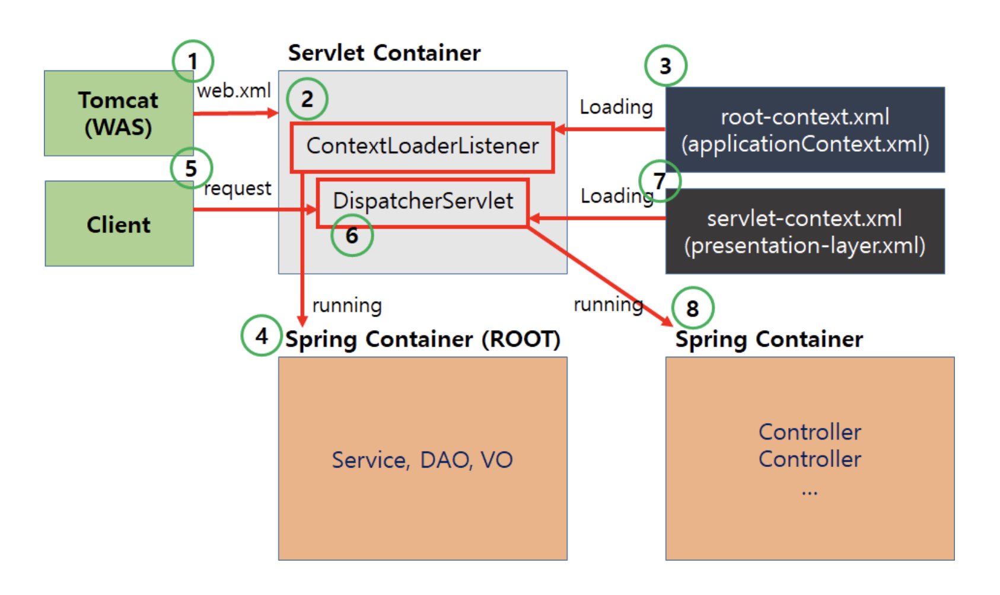

## Spring 프레임워크의 구동 순서

1. **웹 어플리케이션이 실행되면 Tomcat(WAS)에 의해 web.xml이 로딩**
    1. WAS가 최초 구동될 때 WEB-INF 디렉토리에 존재하는 web.xml을 읽고, 그에 해당하는 웹 애플리케이션 설정을 구성한다.
    2. web.xml은 Deployment Descriptor(배포 서술자)로 불리는 것으로, 프로젝트 설정에 대한 기본정보를 가지고 있으며 Spring 프로젝트 실행 전 1차적으로 거쳐간다.
2. **web.xml에 등록되어있는 ContextLoaderListener 생성**
    1. ContextLoaderListener는 ServletContextListener 인터페이스를 구현하며, ApplicationContext 생성함.
    2. **ApplicationContext:** IoC 엔진이며, 빈의 생명주기를 담당한다.
    3. **IoC(Inversion of Control):** 제어의 역전이라는 의미로, 제어권이 개발자(사용자)에게 있지 않고, 프레임워크에 있어서 필요에 따라서 사용자의 코드를 대신 호출하여 수행. 인스턴스의 생성부터 소멸까지 개발자가 아닌 프레임워크(컨테이너)에서 대신 관리하게 된다. Spring 프레임워크의 대표적인 특징 중 하나이다.
3. **ContextLoaderListener가 root-context.xml 로딩**
    1. ContextLoaderListener는 Servlet을 초기화하는 용도로 사용.
    2. 타 Servlet에서 생성된 Bean은 서로 접근 못하지만, ContextLoaderListener를 통해 공통 Bean으로 접근이 가능하다.
4. **root-context.xml등록되어있는 설정에 따라 Spring Container(ROOT) 구동**
    1. root-context.xml에서는 view와 관련되지 않은 객체를 정의합나다. Service, Repository(DAO), DB 등 비즈니스 로직과 관련된 설정을 담당합니다.
5. **Client로부터 Web Application 요청이 되면 DispatcherServlet 생성**
    1. MVC 구조에서 가장 핵심적인 역할을 하는 클래스이며 내부적으로 웹 관련 처리의 준비 작업을 진행한다.
6. **DispatcherServlet에서 XmlWebApplicationContext를 이용해서 servlet-context.xml을 로딩하고 해석**
    1. 클래스에 @Controller 어노테이션을 붙이면 servlet-context.xml에서는 이를 인식하여 컨트롤러로 등록한다.
    2. 이 과정에서 등록된 객체(Bean)들을 기존에 만들어진 객체(Bean)들과 같이 연동
7. **DispatcherServlet으로 온 요청을 HandlerMapping에서 요청의 처리를 담당할 컨트롤러를 찾게 된다.**
    1. HandlerMapping 인터페이스를 구현한 여러 객체 중 @RequestMapping이라는 어노테이션이 적용된 것을 기준으로 판단한다.
8. **적절한 컨트롤러를 찾았다면 HandlerAdapter를 이용해서 해당 컨트롤러를 동작시킨다.**

## Spring VS Spring Boot 차이점

- **Spring**
    
    Spring은 스프링 프레임워크의 핵심 모듈을 모아서 만든 프레임워크이다. Spring에서는 개발자가 직접 설정 파일을 작성하여 스프링 컨테이너를 구성하고, 필요한 빈 객체를 등록하고, 빈 객체 간의 의존성을 설정해야 한다. Spring은 특정한 구성을 위해 추가적인 라이브러리와 설정이 필요하다.
    
- **Spring Boot**
    
    Spring Boot는 스프링 프레임워크를 보다 쉽게 사용할 수 있도록 만든 프레임워크. Spring Boot에서는 개발자가 설정 파일을 작성할 필요 없이, 프로젝트의 설정과 라이브러리 의존성을 자동으로 처리해주는 기능을 제공하는 등 Spring에서 제공하는 여러 기능들을 자동으로 설정하여 개발자가 보다 쉽게 사용할 수 있도록 해준다. 또한, Spring Boot는 실행 가능한 JAR 파일을 만들 수 있습니다.
    
- **차이 요약**
    
    스프링(Spring)은 프레임워크이며, 스프링 부트(Spring Boot)는 스프링 프레임워크를 기반으로 한 도구. 스프링은 설정 파일을 작성해야 하지만, 스프링 부트는 자동 설정을 제공하여 간편하게 개발할 수 있다. 또한, 스프링 부트는 내장 서버를 제공하여 쉽게 웹 애플리케이션을 실행할 수 있다. Spring은 스프링 프레임워크를 보다 세밀하게 제어하고자 하는 경우에, Spring Boot는 빠르고 간단하게 스프링 애플리케이션을 개발하고자 하는 경우에 사용
    
- **Spring Boot의 간단 동작 과정**
    - Spring Boot로 실행할 수 있는 애플리케이션을 만들기 시작하면 클래스에 @SpringBootApplication이라는 어노테이션을 확인할 수 있다.
    - 해당 어노테이션 덕분에 많은 외부 라이브러리, 내장 톰캣 서버 등이 실행
    - @SpringBootApplication 어노테이션 내부에는 @ComponentScan과 @EnableAutoConfiguration 등이 있다.
    - **@ComponentScan**
        - @Component, @Controller, @Repository, @Service라는 어노테이션이 붙어있는 객체들을 스캔해 자동으로 Bean에 등록해준다.
    - **@EnableAutoConfiguration**
        - @ComponentScan 이후 사전에 정의한 라이브러리들을 Bean에 등록해준다.
