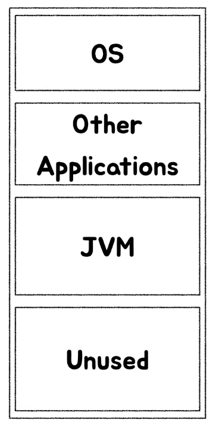
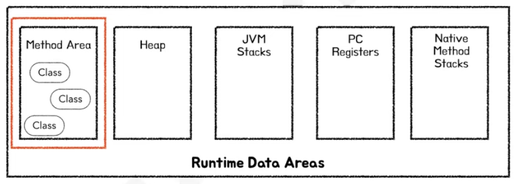
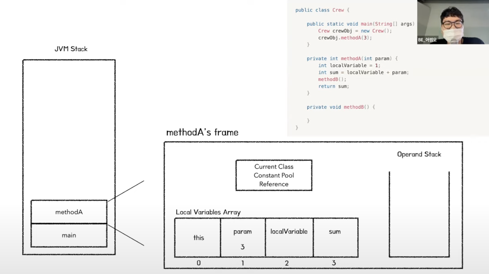
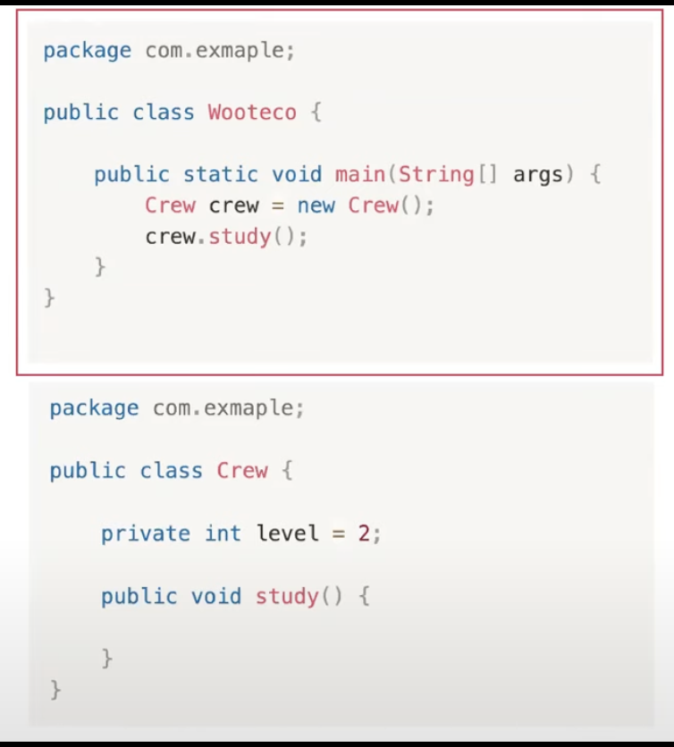
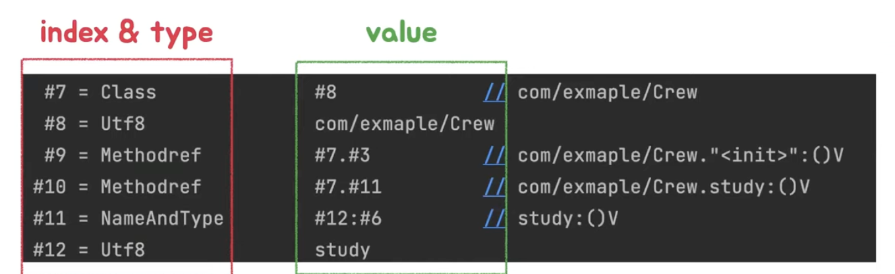

# JVM 추가 질문 정리

#### 1. GC와 관련하여 자바에서 내부 클래스를 선언할 때 static 으로 해야하는 이유

```java
public class Outer {
    class Inner {
        void display() {
            System.out.println("Inner class");
        }
    }
}
```

- 비정적인 내부 클래스는 외부 클래스의 인스턴스에 대한 숨겨진 참조를 하고 있기 때문에 Outer 클래스의 인스턴스가 존재하는 한 Inner 클래스의 인스턴스는 GC의 대상이 되지 않음. 따라서 필요하지 않은 메모리가 해제되지 않는 상황이 발생하여 메모리 누수가 발생.

```java
public class Outer {
    static class Inner {
        void display() {
            System.out.println("Static Inner class");
        }
    }
}
```

- Inner 클래스가 정적으로 선언되어 있기 때문에 Outer 의 인스턴스에 대한 참조를 가지지 않음. 따라서 Outer 클래스의 인스턴스와는 독립적으로 존재할 수 있음. 외부 클래스와 독립적인 생명 주기를 가지며 GC가 발생할 때 불필요한 참조로 인한 메모리 누수가 발생하지 않음. 


#### - 요약

- **비정적 내부 클래스가 외부 클래스의 인스턴스를 참조하는 구조로 인해 Eden 영역에서 객체가 Survivor 영역으로 이동할 때, 외부 클래스 인스턴스가 불필요하게 남아있을 수 있어 메모리 누수를 초래할 수 있고, GC의 효율성을 떨어뜨림.** 

---

###  ✔ Java8 로 변하며 PermG 영역이 사라지고 MetaSpace가 생겼다

- JAVA 7의 JVM


- JAVA 8의 JVM


- PermG 영역의 고정된 크기 때문에 OOM 문제를 해결하고자.
- MetaSpace는 시스템의 네이티브 메모리를 사용하여 클래스 메타데이터를 저장. 필요에따라 동적으로 확장될 수 있기 때문에 위 문제 해결. (OS 레벨에서 관리)
  - Class의 메타데이터, Method의 메타데이터, Class와 관련된 배열 객체 메타데이터, JVM 내부 객체들과 JIT의 최적화 정보 저장
  - **static 객체, 변수 및 String Object -> Heap 에 저장** (기존 PermG)
- **static 변수 및 객체도 Heap 에 저장되기 때문에 GC의 대상이 되긴 함.**
- 그러나 Class 가 JVM 에 로드될 때 Static 변수 및 객체가 생성되고, **해당 클래스가 메모리에 남아있는 한 static 변수 및 객체를 계속해서 참조**하고 있기 때문에 실질적으로 GC의 대상이 아니라고 볼 수 있음. 
- 결론적으로 클래스의 생명 주기와 직접 연관되어 클래스가 메모리에 로드되어 있는 한 static 도 유지됨. 
- 일반적으로 커스텀 클래스 로더를 통해 클래스 로더의 생명 주기를 직접 관리하거나 특정 조건 하에서 클래스를 직접 언로드 하지 않는 이상 보통의 JVM의 클래스 로더는 한 번 로드한 클래스를 클래스 로더가 언로드 되지 않는 이상 언로드 할 수 없음. 그렇기 때문에 로드된 클래스는 재배포 하거나 JVM이 종료되는 시점에 클래스 로더가 언로드 되는 경우를 제외하고는 JVM의 메소드 영역에 보관되며 계속 유효하게 유지됨.  

#### 2. "Hello" 와 new String("Hello")은 각각 어느 메모리 영역에 저장되나요? 만약 그 둘이 다르면 왜 String를 저장하는 방법은 일반적인 참조형 객체를 저장하는 방법과 다른가요?


- String 으로 생성한 문자열 `"Hello"` 는 Heap 영역 내에 String Pool에 저장되어 재사용됨.
- 그러나 `new String("Hello")` 는 같은 내용이라도 여러 개의 객체가 각각 생성되어 Heap 영역을 차지하게 됨. 

```java
public class StringExample {
    public static void main(String[] args) {
        String str1 = "Hello";          // String 리터럴
        String str2 = "Hello";          // String Pool에서 동일한 객체를 참조

        String str3 = new String("Hello");  // 새로운 String 객체 생성
        String str4 = new String("Hello");  // 또 다른 새로운 String 객체 생성

        // str1과 str2는 동일한 객체를 참조
        System.out.println(str1 == str2);   // true

        // str3과 str4는 서로 다른 객체를 참조
        System.out.println(str3 == str4);   // false

        // 문자열 값은 동일함
        System.out.println(str3.equals(str4)); // true
    }
}
```

- **메모리를 효율적으로 사용하기 위해서는 String literal 로 String 을 생성하는 것이 좋다 !!!**


#### 3. JVM은 단순히 자바 언어를 해석하기 위해 존재하는 것인데 자바 외의 언어로 작성된 코드를 위한 메모리 영역이 왜 존재하게 되는건가요?

- JVM 은 자바 프로그램을 실행하기 위해 만들어졌지만 자바로만 작성된 코드가 아니라 성능이나 기존의 레거시 시스템과의 통합을 위해 네이티브 코드와 상호작용이 필요할 수 있음. (운영체제 혹은 라이브러리와 상호작용)
- 네이티브 코드를 호출하기 위해 JNI 를 사용함. 이 과정에서 **네이티브 메서드의 구현과 관련된 메타데이터 및 코드가 네이티브 메서드 영역에 저장됨.**

####	📌 JNI (Java Native Interface)

- 다른 언어들로 작성된 라이브러리들을 호출하거나 반대로 호출되는 것을 가능하게 하는 프로그래밍 프레임워크


#### 4.  각각의 Area에 할당된 메모리 사이즈가 어떻게 될까요?

- JVM 설정 및 시스템에 따라 달라질 것 같습니다 !


#### 5. 컴파일과 빌드는 다른 것인가요? gradle이나 maven이 하는 역할을 말해주시고, jar 파일에 대해서 class와 비교하여 말씀해주세요

##### (1) 컴파일

- 소스 코드를 기계가 이해할 수 있는 바이트 코드로 변환하는 과정.
- `.java` 파일을 `.class` 파일로 변환하는 과정

##### (2) 빌드

- 소스 코드를 실행 가능한 프로그램으로 만들기 위한 일련의 작업. 
- 컴파일, 테스트, 패키징 배포 등이 포함됨. 
  - 종속성 다운로드 - **전처리(Preprocessing)**
  - 소스코드를 바이너리 코드로 **컴파일(Compile)**
  - 바이너리 코드를 **패키징(Packaging)**
  - **테스트** 실행(Testing)
  - 프로덕션 시스템에 **배포(distribution)**
- `.jar` `.war` 파일 생성


#### (3) gradle과 maven

- 빌드 관리 도구 
- Maven 은 `pom.xml` 파일을 통해 프로젝트 설정 및 의존성 관리를 진행.
- Gradle 은 `build.gradle` 파일을 통해 프로젝트 설정 및 의존성 관리 진행. 

-  차이점 추가 정리 필요


##### (4) JAR 와 `.class`

- `.class`
  - 자바 컴파일러에 의해 컴파일된 바이트 코드. 각 클래스 마다 하나의 `.class` 파일이 생성됨 
- `.jar`
  - 여러 개의 클래스 파일과 관련 리소스 파일(이미지, 텍스트 등) 을 포함하는 압축된 파일 


---

#### 📍 어썸오의 JVM Memory Layout 테코톡 정리

### 📌 JVM 이란 ?

- Java Byte Code를 운영체제에 맞게 해석해주는 역할
- 작성한 자바 프로그램의 실행 환경을 제공하는 자바 프로그램의 구동 엔진 
- Java Compiler 는 `.java` 파일을 `.class` 라는 자바 바이트 코드로 변환시켜준다. 하지만 바이트 코드는 기계어(Native Code)가 아니므로 OS에서 바로 실행이 되지 않는데, 이 때 JVM은 OS가 Byte Code를 이해할 수 있도록 해석해주는 역할을 한다. 
- **JVM 을 사용하면 하나의 바이트코드로 모든 플랫폼에서 동작하도록 할 수 있다.** 
- JVM 은 **메모리 관리**도 담당한다. 이를 **가비지 컬렉터(GC)**라고 한다. 


## JVM Memory Layout
- 목적 : 자바 코드를 실행할 때 JVM 런타임 데이터 영역에서 어떤 일이 일어나는지 이해하기
- 발표 대상
1. JVM이 무엇이고 왜 필요한지 대략적으로 아는 사람
2. 바이트코드가 무엇인지 알고 한 번이라도 본 적 있는 사람
3. 자바 코드가 실행될 때 JVM 안에서 구체적으로 어떤 일이 일어나는지 궁금한 사람

- **컴퓨터 메모리 구조 레이아웃**

### 1. JVM의 구조
- java 소스코드를 작성하고 java 컴파일러를 통해 컴파일을 하면 `.class` 파일이 생성이 됨. 


- java 명령어로 class 파일을 실행하면, JVM은 class loader를 통해 이 클래스를 읽어들임.
- 클래스 파일 안에는 클래스 안에 어떤 필드가 몇 개 선언 되어있는지, 메서드는 몇 개이고 이름은 무엇인지, 바이트코드까지 포함한 클래스의 모든 정보를 담고 있음. 

- **Class Loader System**은 클래스 파일 정보를 Method Area 에 올리고, static 변수 등을 초기화 하는 역할을 함. 
- **Runtime Data Area**는 JVM이라는 가상 머신이 사용하는 메모리 공간 

- **바이트코드**란 JVM이 알아들을 수 있는 명령어들의 집합을 의미.
- JVM의 목적은 바이트 코드를 기계어로 번역해서 CPU에게 일을 시킴. 
- 바이트 코드를 기계어로 번역하는 일을 **Interpreter**가 실행함.
### 2. Runtime Data Area

1. Method Area 
	1. 클래스에 대한 모든 정보가 저장되는 영역 
2. Heap
	1. 런타임에 생성되는 모든 객체들이 저장됨. 
	2. GC가 동작하는 곳
3. JVM Stacks 
	1. 메서드를 실행하기 위한 정보들이 저장되는 공간 
	2. Frame 이라는 자료 구조가 존재.
	3. Frame은 메서드가 하나 호출될 때 마다 새로 생기고, 메서드가 끝나거나 예외가 발생하면 사라진다. 
4. PC Registers
	1. 현재 실행되고 있는 명령어의 주소를 저장하는 곳. 
	2. 멀티스레드 프로그래밍 환경에서 한 스레드가 작업을 하다가 다른 스레드로 잠시 cpu 점유를 넘겨주고 다시 돌아왔을 때 이전 작업을 저장하기 위한 영역
5. Native Method Stacks
	1. C나 C++로 작성된 메서드를 실행할 때 사용되는 스택 
	
- Method Area와 Heap 영역은 모든 스레드가 공유하는 영역이기 때문에 멀티 스레드 환경에서 동기화에 유의해야 함. 
- JVM Stacks, PC Registers, Native Method Stacks 는 스레드가 생성될 때 마다 새로 생기는 영역들로, 서로 다른 스레드 간 침범할 수 없음.
	- 그래서 하나의 메서드 안에서 다른 메서드의 지역 변수의 동시성 문제를 걱정하지 않아도 됨. 
### 3. JVM Stack

- 프레임 내에는 현재 클래스의 컨스턴트 풀에 대한 참조, 지역 변수 배열, Operand Stack이 있음.
- 지역 변수 배열은 메서드 내의 지역변수들을 담고 있는 배열. 
- 인스턴스 메서드는 항상 제일 첫 번째 인덱스에 현재 인스턴스에 대한 참조를 가지고 있음. 
- Method A는 인스턴스 메서드이기 때문에 자기 자신에 대한 참조 this 를 갖고 있음. 
- **Operand Stack**
	- jvm은 스택 기반으로 연산 수행
	- 피연산값 혹은 연산의 중간값을 저장하기 위한 자료 구조 

#### * 바이트코드


### 4. Method Area & Heap



#### *Constant pool (상수 풀)
- 클래스 내에 사용되는 상수들을 담은 테이블 

- 8번 인덱스 처럼 참조하는 대상의 이름만을 String으로 지칭하는 것을 **Symbolic Reference** 라고 함. 이 값이 Crew 데이터의 값을 가리키는 포인트로 사용됨. 
- 이게 Crew Class 를 Class Loader 를 통해 Method Area로 읽어오면서 Crew Class 를 가리키는 참조값을 변환됨. 

#### *상수풀의 구성

- **Symbolic Reference **

  - Class References : 다른 클래스나 인터페이스 참조

  - Filed References : 클래스 또는 인터페이스의 필드 참조

  - Method References : 메소드 호출에 사용되는 참조 

  - Interface Method References : 인터페이스 내의 메소드 참조

  - Name and Type Descriptors : 필드나 메소드의 이름과 그 타입을 저장

- **리터럴 값 (Literals)**

  - Numeric Literlas : int, float, long, double 과 같은 기본 타입의 숫자 값들
  - String Literals : 직접적인 문자열 값. 자바 소스 코드 내의 문자열 상수에 해당하며, `ldc` 명령어를 통해 로드됨. 

#### *상수풀의 역할

- **코드 최적화와 관리**
  - 클래스 파일 내에서 반복되는 정보의 중복 저장을 방지하고, 코드의 재사용과 최적화를 도와줌
- **실행 시 해석 (Resolving)**
  - 클래스 파일이 JVM에 로드될 때, 상수풀에 저장된 Symbolic References 는 Direct Reference로 Resolving 되어 JVM 이 실행할 수 있는 형태로 변환됨.

---

### ✔ Symbolic Reference

- **Symbolic Reference 란 ?**
  - 클래스, 인터페이스, 필드 또는 메서드를 포함하는 참조를 가리키는데 사용되는 개념
  - 이름, 타입, 그리고 클래스 내에서의 스코프(ex: 클래스 이름) 등의 정보를 기반으로 식별되며, 실제 메모리 주소나 위치와는 독립적
  - Java 컴파일 과정에서 생성되는 클래스 파일 내에서 해당 요소들이 어떻게 참조되는지를 나타냄.
  - Java 소스 코드가 컴파일 될 때, 모든 클래스, 메서드, 필드의 참조는 초기에 Symbolic Reference로 표현됨. 
  - **식별자** 라고 생각. 
- **간단한 예시**
  - `Crew` 클래스에서 `name` 필드를 참조하려고 할 때, 컴파일된 코드에서는 `Crew.name` 이라는 **Symbolic Reference**를 사용. **클래스가 로드되고 해석(Resolution)** 과정을 거쳐 JVM은 `Crew` 클래스의 실제 메모리 주소과 `name` 필드의 정확한 위치를 찾아내 **Direct Reference** 로 변환. 

```java
public class org.jvminternals.SimpleClass
	SourceFile: "SimpleClass.java"
	minor version: 0
	major version: 51
	flags: ACC_PUBLIC, ACC_SUPER
     	//상수풀!!! 이 부분을 보세요!
			Constant pool:
			   #1 = Methodref          #6.#17         //  java/lang/Object."<init>":()V
			   #2 = Fieldref           #18.#19        //  java/lang/System.out:Ljava/io/PrintStream;
			   #3 = String             #20            //  "Hello"
			   #4 = Methodref          #21.#22        //  java/io/PrintStream.println:(Ljava/lang/String;)V
			   #5 = Class              #23            //  org/jvminternals/SimpleClass
			   #6 = Class              #24            //  java/lang/Object
			   #7 = Utf8               <init>
			   #8 = Utf8               ()V
			   #9 = Utf8               Code
			  #10 = Utf8               LineNumberTable
			  #11 = Utf8               LocalVariableTable
			  #12 = Utf8               this
			  #13 = Utf8               Lorg/jvminternals/SimpleClass;
			  #14 = Utf8               sayHello
			  #15 = Utf8               SourceFile
			  #16 = Utf8               SimpleClass.java
			  #17 = NameAndType        #7:#8          //  "<init>":()V
			  #18 = Class              #25            //  java/lang/System
			  #19 = NameAndType        #26:#27        //  out:Ljava/io/PrintStream;
			  #20 = Utf8               Hello
			  #21 = Class              #28            //  java/io/PrintStream
			  #22 = NameAndType        #29:#30        //  println:(Ljava/lang/String;)V
			  #23 = Utf8               org/jvminternals/SimpleClass
			  #24 = Utf8               java/lang/Object
			  #25 = Utf8               java/lang/System
			  #26 = Utf8               out
			  #27 = Utf8               Ljava/io/PrintStream;
			  #28 = Utf8               java/io/PrintStream
			  #29 = Utf8               println
			  #30 = Utf8               (Ljava/lang/String;)V
			{
			  public org.jvminternals.SimpleClass();
				Signature: ()V
				flags: ACC_PUBLIC
				Code:
				  stack=1, locals=1, args_size=1
					0: aload_0
					1: invokespecial #1    // Method java/lang/Object."<init>":()V
					4: return
				  LineNumberTable:
					line 3: 0
				  LocalVariableTable:
					Start  Length  Slot  Name   Signature
					  0      5      0    this   Lorg/jvminternals/SimpleClass;

			  public void sayHello();
				Signature: ()V
				flags: ACC_PUBLIC
				Code:
				  stack=2, locals=1, args_size=1
					0: getstatic      #2    // Field java/lang/System.out:Ljava/io/PrintStream;
					3: ldc            #3    // String "Hello"
					5: invokevirtual  #4    // Method java/io/PrintStream.println:(Ljava/lang/String;)V
					8: return
				  LineNumberTable:
					line 6: 0
					line 7: 8
				  LocalVariableTable:
					Start  Length  Slot  Name   Signature
					  0      9      0    this   Lorg/jvminternals/SimpleClass;
			}
   
	
```

- 위의 경우에는 Constant Pool 의 인덱스를 통해 참조. (Symbolic Referece 임)

- 예를 들어 `5: invokevirtual  #4` 명령어는 Constant Pool에서 
  ```java
  #4 = Methodref          #21.#22 
  ↓ // Class.NameAndType → 
  #21 = Class              #28            //  java/io/PrintStream
  #22 = NameAndType        #29:#30        //  println:
  ↓ // java/io/PrintStream 클래스의 println 메서드에서 파라미터로 받은 String 출력, 그리고 Void. 
  #28 = Utf8               java/io/PrintStream
  #29 = Utf8               println
  #30 = Utf8               (Ljava/lang/String;)V
      
  // PrintStream.println(String)
  ```

  - 위 순서로 찾아가게 됨. 
  - 결과적으로 `#4`의 Symbolic Reference는 참조하고 참조하고 참조하다가 Method를 실행하기 위한 `println` 메서드의 실제 실행 코드 주소로 변환됨.

---

[어썸오의 JVM Memery Layout](https://www.youtube.com/watch?v=GU254H0N93Y)

[JNI (JAVA Native Interface)](https://velog.io/@vrooming13/JNI-JAVA-Native-Interface)

[Maven 과 Gradle](https://velog.io/@leesomyoung/Maven%EA%B3%BC-Gradle%EC%9D%98-%EC%B0%A8%EC%9D%B4-%EB%B0%8F-%EB%B9%84%EA%B5%90)

[Runtime Data Area의 구성](https://velog.io/@indongcha/Runtime-Data-Area%EC%9D%98-%EA%B5%AC%EC%84%B1#runtime-constant-pool)