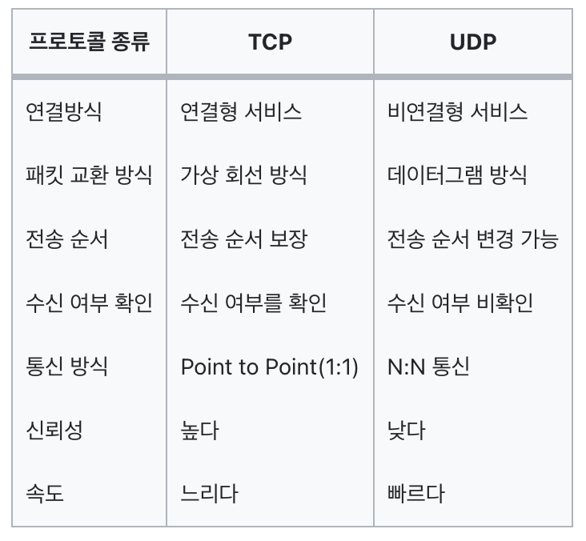

### TCP란 무엇인가?

- TCP는 Transmission Control Protocol로서 연결형 서비스를 지원하며 인터넷상에서 데이터를 메세지의 형태로 보내기 위해 IP와 함께 사용하는 프로토콜이다.
- IP가 데이터의 배달을 처리한다면 TCP는 패킷을 추적 및 관리하게 된다.
- TCP의 특징으로는 아래와 같은 것들이 있다.
    - 연결 지향 방식으로 패킷 교환 방식을 사용한다.(가상 회선 방식이 아님)
    - **3-way handshaking**과정을 통해 연결을 설정하고 **4-way handshaking**을 통해 해제한다.
    - 흐름 제어 및 혼잡 제어(이러한 기능은 CPU를 사용하기 때문에 속도에 영향을 준다.)
    - 높은 신뢰성을 보장한다.
    - UDP보다 속도가 느리다.
    - 전이중(Full-Duplex), 점대점(Point to Point) 방식
- 신뢰성 있는 데이터 전송이 가능하다는 장점으로 인해 HTTP, FTP, TELNET 등 대부분의 응용 계층 프로토콜의 전송 계층으로 사용되고 있다.

### 흐름제어와 혼잡제어란?

흐름제어는 데이터를 송신하는 곳과 수신하는 곳의 데이터 처리 속도를 조절하여 수신자의 버퍼 오버플로우를 방지하는 것이다. 예를 들어 송신하는 곳에서 감당이 안되게 데이터를 빠르게 많이 보내면 수신자에서 문제가 발생하기 때문이다.
혼잡제어는 네트워크 내의 패킷 수가 넘치게 증가하지 않도록 방지하는 것이다. 만약 정보의 소통량이 과다하면
패킷을 조금만 전송하여 혼잡 붕괴 현상이 일어나는 것을 막는다.

### 3-way handshaking이란?

- 서로의 통신을 위해 포트를 확인하고 연결하기 위해 3번의 요청/응답(SYN, ASK)이 되는 것을 말한다.
- 연결 과정
    1. Client에서 Server에 연결 요청을 하기위해 SYN 데이터를 보낸다.
    2. Server에서 해당 포트는 LISTEN 상태에서 SYN 데이터를 받고 SYN_RCV로 상태가 변경된다.
    3. 그리고 요청을 정상적으로 받았다는 대답(ACK)와 Client도 포트를 열어달라는 SYN 을 같이 보낸다.
    4. Client에서는 SYN+ACK 를 받고 ESTABLISHED로 상태를 변경하고 서버에 ACK 를 전송한다.
    5. ACK를 받은 서버는 상태가 ESTABLSHED로 변경된다.

### 4-way handshaking이란?

- 세션을 종료하기 위해 수행되는 절차를 말한다.
- 연결 과정
    1. Client가 연결을 종료하겠다는 FIN플래그를 전송한다. 보낸 후에 FIN-WAIT-1 상태로 변한다.
    2. FIN 플래그를 받은 Server는 확인메세지인 ACK를 Client에게 보내준다. 그 후 CLOSE-WAIT상태로 변한다. Client도 마찬가지로 Server에서 종료될 준비가 됐다는 FIN을 받기위해  FIN-WAIT-2 상태가 된다.
    3. Close준비가 다 된 후 Server는 Client에게 FIN 플래그를 전송한다.
    4. Client는 해지 준비가 되었다는 정상응답인 ACK를 Server에게 보내준다. 이 때, Client는 TIME-WAIT 상태로 변경된다.(여기서 TIME-WAIT 상태는 의도치않은 에러로 인해 연결이 데드락으로 빠지는 것을 방지하기 위해 변경 되는 것인데, 만약 에러로 인해 종료가 지연되다가 타임이 초과되면 CLOSED 상태로 변경된다.)

### TCP의 연결 설정 과정(3단계)과 연결 종료 과정(4단계)이 단계가 차이나는 이유?

Client가 데이터 전송을 마쳤다고 하더라도 Server는 아직 보낼 데이터가 남아 있을 수 있기 때문에 일단 FIN에 대한 ACK만 보내고, 데이터를 모두 전송한 후에 자신도 FIN 메세지를 보내기 때문이라고 볼 수 있다.

### 만약 Server에서 FIN 플래그를 전송하기 전에 전송한 패킷이 Routing 지연이나 패킷 유실로 인한 재전송 등으로 인해 FIN 패킷보다 늦게 도착하는 상황이 발생하면 어떻게 될까?

위에서 4way handshake과정 마지막 부분에서 말한 TIME-WAIT을 말한 부분이 답이라고 보면되는데, TCP는 이러한 현상에 대비하여 Client는 Server로부터 FIN 플래그를 수신하더라도 일정시간동안 세션을 남겨놓고 잉여 패킷을 기다리는 과정을 거친다.

### 초기 Sequence Number인 ISN을 0부터 시작하지 않고 난수를 생성해서 설정하는 이유?

Connection을 맺을 때 사용하는 포트(Port)는 유한 범위 내에서 사용하고 시간이 지남에 따라 재사용된다. 따라서 두 통신 호스트가 과거에 사용된 포트 번호 쌍을 사용하는 가능성이 존재한다. 서버 측에서는 패킷의 SYN을 보고 패킷을 구분하게 되는데 난수가 아닌 순처적인 Number가 전송된다면 이전의 Connection으로부터 오는 패킷으로 인식할 수 있다. 이런 문제가 발생할 가능성을 줄이기 위해서 난수로 ISN을 설정한다.

### TCP 서버의 특징

- 서버소켓은 연결만을 담당한다.
- 연결과정에서 반환된 클라이언트 소켓은 데이터의 송수신에 사용된다.
- 서버와 클라이언트는 1대1로 연결된다.
- 스트림 전송으로 전송 데이터의 크기가 무제한이다.
- 패킷에 대한 응답을 해야하기 때문에 성능이 낮다.
- Streaming 서비스에 불리하다.(손실된 경우 재전송 요청을 하므로)

### 패킷이란 무엇인가?

인터넷 내에서 데이터를 보내기 위한 경로배정(라우팅)을 효율적으로 하기 위해서 데이터를 여러 개의 조각들로 나누어 전송을 하는데 이때, 이 조각을 패킷이라고 한다.

### TCP는 패킷을 어떻게 추적 및 관리하는가?

위에서 데이터는 패킷단위로 나누어 같은 목적지(IP계층)으로 전송된다고 설명하였습니다. 예를 들어 한줄로 서야하는 A,B,C라는 사람(패킷)들이 서울(발신지)에서 출발하여 부산(수신지)으로 간다고 합시다. 그런데 A,B,C가 순차적으로 가는 상황에서 B가 길을 잘못 들어서 분실되었다고 합시다. 하지만 목적지에서는 A,B,C가 모두 필요한지 모르고 A,C만 보고 다 왔다고 착각할 수 있습니다. 그렇기 때문에 A,,B,C라는 패킷에 1,2,3이라는 번호를 부여하여 패킷의 분실 확인과 같은 처리를 하여 목적지에서 재조립을 합니다. 이런 방식으로 TCP는 패킷을 추적하며, 나누어 보내진 데이터를 받고 조립을 할 수 있습니다.

### UDP란 무엇인가?

- UDP는 User Datagram Protocol로서 TCP와 달리 비연결형 프로토콜이며 데이터를 데이터그램 단위로 처리하는 프로토콜이다.
- 여기서 데이터그램이란 독립적인 관계를 지니는 패킷이라는 뜻이다.
- 연결을 위해 할당되는 논리적인 경로가 없고, 그렇기 때문에 각각의 패킷은 다른 경로로 전송되고, 각각의 패킷은 독립적인 관계를 지니게 된다.
- 서로 다른 경로로 독립적으로 처리함에도 패킷에 순서를 부여하여 재조립을 하거나 흐름 제어 또는 혼잡 제어와 같은 기능도 처리하지 않기에 TCP보다 속도가 빠르며 네트워크 부하가 적다는 장점이 있다.

### UDP의 특징

- 비연결형 서비스로 데이터그램 방식을 제공한다.
- 정보를 주고 받을 때 정보를 보내거나 받는다는 신호절차를 거치지 않는다.
- UDP헤더의 CheckSum 필드를 통해 최소한의 오류만 검출한다.
- 신뢰성이 낮다.
- TCP보다 속도가 빠르다.

### UDP 서버의 특징

- UDP에는 연결 자체가 없어서 서버 소켓과 클라이언트 소켓의 구분이 없다.
- 소켓을 활용해 IP와 PORT를 기반으로 데이터를 전송한다.
- 서버와 클라이언트는 1대1, 1대N, N대M 등으로 통신할 수 있다.
- 데이터그램(메세지) 단위로 전송되며 그 크기는 65535바이트로, 크기가 초과하면 잘라서 보낸다.
- 흐름제어가 없어서 패킷이 제대로 전송되었는지, 오류가 없는지 확인할 수 없다.
- 성능이 중요시 되는 경우에 사용

### TCP와 UDP의 비교

- 공통점
    - 둘다 소켓을 활용하기에 포트 번호를 이용하여 주소를 지정한다.
    - 데이터 오류 검사를 위한 체크섬 존재한다.
- 차이점
    
    
    
- 사용처
    
    TCP는 신뢰성 있는 전송이 중요한 웹 브라우징(HTTP, HTTPS), 이메일, 파일 전송(FTP), 데이터베이스 연결과 같은 애플리케이션에서 주로 사용된다.
    
    UDP는 실시간 전송이 중요한 애플리케이션에서 주로 사용된다. 예를 들어, 온라인 게임, 스트리밍, VoIP, DNS 요청, 간단한 메시지 교환 등의 애플리케이션에서 사용된다.
    

### 참고(출처)

- https://mangkyu.tistory.com/15
- https://jeongkyun-it.tistory.com/180
- [https://velog.io/@devharrypmw/TCPUDP-TCP와-UDP의-특징과-차이](https://velog.io/@devharrypmw/TCPUDP-TCP%EC%99%80-UDP%EC%9D%98-%ED%8A%B9%EC%A7%95%EA%B3%BC-%EC%B0%A8%EC%9D%B4)
- [https://github.com/fhwmqkfl/YJs_TIL/blob/1af023c35d2099b5d3524579a6d7a8595862c47c/CS/네트워크/socket.md](https://github.com/fhwmqkfl/YJs_TIL/blob/1af023c35d2099b5d3524579a6d7a8595862c47c/CS/%EB%84%A4%ED%8A%B8%EC%9B%8C%ED%81%AC/socket.md)
- [https://hstory0208.tistory.com/entry/TCP와-UDP의-차이-개념에-대해-쉽게-알아보자](https://hstory0208.tistory.com/entry/TCP%EC%99%80-UDP%EC%9D%98-%EC%B0%A8%EC%9D%B4-%EA%B0%9C%EB%85%90%EC%97%90-%EB%8C%80%ED%95%B4-%EC%89%BD%EA%B2%8C-%EC%95%8C%EC%95%84%EB%B3%B4%EC%9E%90)
