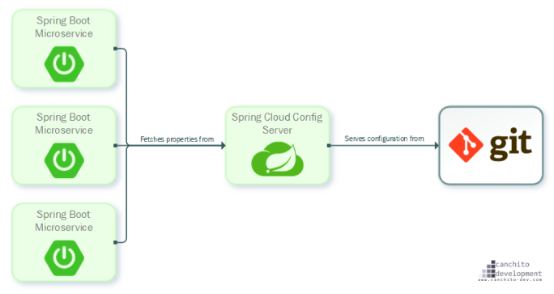
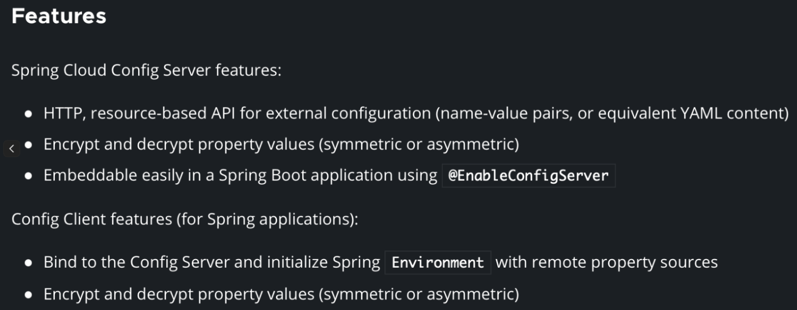
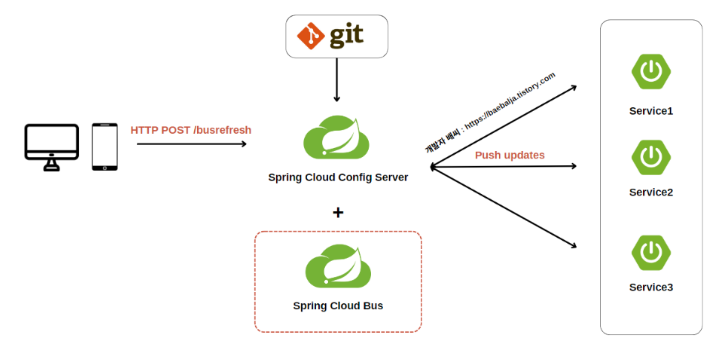

# 1. Spring Cloud Config란?
### 개념
- 분산 시스템에서 외부화된 설정 정보를 서버 및 클라이언트에게 제공하는 시스템
- 외부에서 모든 환경에 대한 정보들을 관리해주는 중앙 서버
- 설정 정보 저장을 위해 git을 사용하도록 되어 있어 손쉽게 외부 도구들로 접근가능하고 버전 관리도 가능
- 
	- Spring Cloud Server: 버전 관리 레보피토리, 백업된 중앙 집중식 구성 노출 지원
	- Spring Cloud Config Client: 어플리케이션이 설정 서버에 연결하도록 지원

### 장단점
- 장점
	- 설정 파일 변경 시 재배포 없이 적용 가능
	- 여러 서버의 설정 파일을 중앙 서버에서 관리 가능
- 단점
	- Git서버에 의존적임.
	- 우선 순위에 의해 설정 정보가 덮어씌워질 수 있음.

### 설정 파일을 읽는 순서
1.  프로젝트의 `application.yml`
2. 설정 저장소의 `application.yml`
3. 프로젝트의 `application-{profile}.yml`
4. 설정 저장소의 `{application_name}/{application_name}-profile.yml`
=> 그렇기 때문에 환경변수 `password`가 로컬의 yml,  application-local.yml에 있고 설정 장소의 application.yml, test/test-local.yml에도 있다면? 정용되는 값은 test/test-local.yml이다.

### 설정 방법
``` yaml
server:
  port: 8888
spring:
  application:
    name: config
  cloud:
    config:
      server:
        git:
          uri: https://github.com
          search-paths: cloud-config-file/**
          default-label: master
```
- 기본 설정 포트는 8888이다.
- default-label: 깃 주소의 브랜치 이름
- search-path: 설정 파일들을 찾을 경로

-> 마지막으로 메인 클래스에 `@EnableConfigServer`을 붙여주면 끝!

# 2. Config Server의 암호화

- Private레포지토리에 저장한다 하더라고 보안 위협을 제거할 수 있는 것은 아니다...!
- 또한, 설정 파일 저장소의 데이터가 Config Server로 네트워크를 통해 전송될 때 Plain Text형태로 전송되기 때문에 중요한 정보 탈취 가능
- 즉, Config Server가 바라보고 있는 설정 정보 저장소에서 데이터를 암호화 해 저장해야하며, 데이터를 가져 온 후 복호화를 해야함!
- 대칭키, 비대칭키 2가지 방법으로 암호화 진행 가능

### 대칭키 암호화 방식
1. Config server의 yml에 encryt-key 속성 추가
``` yaml
encrypt:
		key:{내가 설정한 암호화 key}
```
2. POST http://{config 서버 주소}:8888/encrypt에 암호화 하고자 하는 내용을 Body에 담아 전송하면 암호화된 내용이 반환됨.
3. 복호화는? /decrypt로 진행
4. 클라이언트 서버는 내부족으로 암호화 데이터는 Decrypt해 Micro Service에 전달함.
=> 설정 파일에 `{cipher}암호화된 텍스트`형식을 맞추어 작성해야 암호화된 TEXT로 인지할 수 있음

> [!warning]
> 하지만 대칭키가 노출될 경우 끝장!

### 비대칭키 암호화 방식
이.. 있습니당..!

# Git레포 내용 재배포 없이 적용하기
> [!info] 사용 가능한 방법!
> 1. actuator API
> 2. Spring Cloud Bus사용
> 3. Watcher를 통해 변경 여부 확인

### actuator API
- 가장 간단한? 방법!
- [actuator에서 제공하는 EndPoint](https://docs.spring.io/spring-boot/docs/2.1.8.RELEASE/reference/html/production-ready-endpoints.html#production-ready-endpoints-enabling-endpoints)
- 사용 방법은 Config Server의 yml파일에 추가
``` yaml
	management: 
		endpoints: 
			web: 
				exposure: 
					include: health, beans, refresh
```
- include에 `*`을 사용할 수 있지만 민감 정보들이 포함될 수 있으므로 필요한 endPoint만 추가하는 것을 권장!
- `POST /refresh`를 사용하면 변경 값 적용 가능! 이때, 반환 값은 바뀐 내용
- 마이크로 서비스가 많다면? 수동으로 이걸 어떻게 다 할까...

### Spring Cloud Bus

- 동적으로 Config변경을 적용하기 위한 Message Queue Handler
- 이전에는 각 마이크로 서비스에서 actuator refresh 방식으로 개별적으로 수정된 설정 정보들을 적용시켜주었다면 spring cloud bus를 활용하면 Spring Cloud Bus에 연결된 누구에게라도 호출을 하게 되면 다른 서비스에게 까지 전달 됨.
- 즉, 어떤 서비스든 `POST /busrefresh`라는 actuator를 호출하면 전체가 다 업데이트 한당!
- Rabbit MQ를 활용해 구현 가능(Kafka와 같이 AMQP프로토콜을 사용하는 메시지 프로커를 사용해야함.)
	- AMQP? Advanced Message Queuing Protocol. 
		- MQ(Message Queuing)기반의 프로토콜
		- 서로 다른 시스템들 간의 최대한 효율적인 방법으로 메세지를 교환하기 위해 탄생

### Watcher
- Spring Cloud Bus사용 시 관리할 서버가 늘어난다면 호출 부담이 있음.
- 설정 파일 변경을 감지하고 변경 사항을 수신하는 기능 제공
