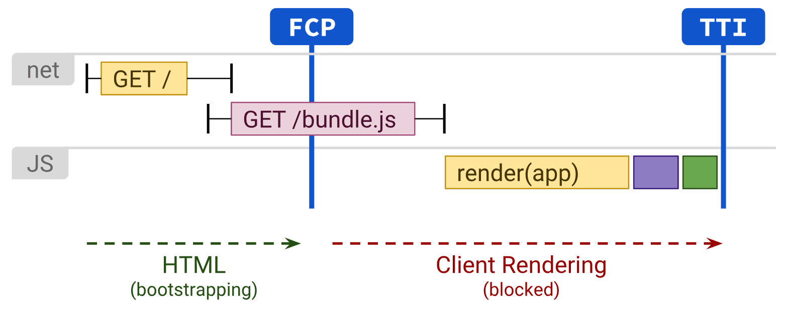

# CSR, SSR (feat. NextJS의 api)

### Rendering이란?

- Rendering
    - 내용을 화면에 표시하는 것
    - 사용자 → 서버에 페이지에 대한 요청
    - html, view와 같은 리소스를 어떻게 보여질지 해석하여 → 그 자료를 기반으로 렌더링

- Client Side Rendering
    
    
    
    - 모든 페이지를 브라우저에서 Javascript를 통해 직접 렌더링하는 방식
        - 서버는 정적 파일 + API 응답만 제공
        - 클라이언트 성능에 좌우되는 경우가 큼
        - 모바일 → 최적화에 어려움이 있음.

## SSR 은 무엇인가?

- SSR이란?
    - SSR은 서버에서 사용자에게 보여줄 페이지를 모두 구성하여 사용자에게 페이지를 보여주는 방식
    - SSR은 새로운 방식 X , 기존에 사용하던 방식의 발전 O
        - JSP/Servlet
            
            
            
    
    
    
    - FCP : First Contentful Paint → 성능 지표에서 쓰이는 개념
        - 사용자가 웹 페이지를 요청한 후 처음으로 유의미한 콘텐츠가 화면에 표시되는 시점
        - 초기 로딩 속도 성능 평가에 중요함
    - TTI : Time To Interactive
        - 페이지가 완전히 로드 되고 사용자와 상호작용 할 준비가 되는 시점 의미
    

- Client Side Rendering vs Server Side Rendering
    - CSR vs SSR
    


- 네이버의 기존 → SPA → SSR 도입기


- 장점
    - 백엔드와의 구조/역할 분리 가능해짐
    - SEO 최적화
    - SEO ??
        - 검색엔진 최적화를 의미함
            
            → 검색엔진은 Javascript를 실행하지 못함
            
            → CSR : 빈 HTML만을 보게 됨
            
            → SSR  :  내부 요소를 크롤러가 확인할 수 있음
            
        - SSR 을 하는 이유 ⇒ 기존에 백엔드에서 JSP로 따로 페이지를 생성했던 이유.

### 그래서 NextJS가 뭔데?

- NextJS
    - React의 프레임워크
    - SSR / CSR을 모두 지원하며 손쉽게 설정 가능함
        - 페이지 캐싱, route 등 다양한 기능 제공
        - 동적 MetaData 생성 등 → 동적 오픈그래프 생성이 가능함
            - 사용자가 누구냐에 따른 이름 동적 생성 / 링크 url에 따른 구분 등
            
            
            
            
            
- NextJS 14의 **API Routes**
    - NextJS “우리는 우리끼리 다 해결 가능해” (?) 라는 기조의 업뎃을 진행 중
    
    ```jsx
    import type { NextApiRequest, NextApiResponse } from 'next'
     
    type ResponseData = {
      message: string
    }
     
    export default function handler(
      req: NextApiRequest,
      res: NextApiResponse<ResponseData>
    ) {
      res.status(200).json({ message: 'Hello from Next.js!' })
    }
    ```
    

- api 폴더 기반 라우팅 구조
    
    /api/user/{id} ← 이게 api 주소가 됨
    
    
    
    - FE 개발자들에게는 편안함
        - Front 서버만 올리면 모든게 해결됨 → Firebase 등 클라우드DB와 연동하면 아주 간편
    - SSG(Static Side Generation) 정적 페이지 렌더링 개념
        - 빌드 타임에 모든 걸 생성 후 고정
            - SEO를 위한 pre-rendering
            - client에서 아무것도 변경 x
            - Blog글 같은 것!

### NextJS는 발전인가? 회귀인가?

- PHP
    - **서버측 스크립트** / 웹페이지 프로그래밍 언어
    - (나름) 동적으로 웹페이지를 만들어주는 역할
    - Javascript와의 차이점
        - PHP는 서버에서 실행된다. → 웹브라우저는 PHP없는 HTML을 받음
        - 따라서 보안성이 뛰어나고, 웹브라우저 대부분과 호환이 됨
    - 거의 모든 데이터베이스와 연동이 편리하다 (MySQL, Oracle .. )
        - 직접 DB와 연결한다
        - servername.. 등으로 연결
        - 쿼리 실행을 직접함.. (쿼리를 코들로 작성함.)
    - 속도도 빠르다. (인터프리터 방식)
    - 단점
        - 점점 복잡해짐 → 간단한 인터렉션이 어려움(사용자와)
        - 변화값이 있는 화면에 부적절

- FE - Back 분리 했던 건데……..
    - NEXTJS는… 다시 돌아가는 중
    
    
    

---

https://d2.naver.com/helloworld/7804182

https://linked2ev.github.io/devlog/2018/11/11/JSP-5.-JSP-Compile/

https://asfirstalways.tistory.com/244

https://medium.com/walmartglobaltech/the-benefits-of-server-side-rendering-over-client-side-rendering-5d07ff2cefe8

https://web.dev/articles/rendering-on-the-web?hl=en

https://velog.io/@sunaaank/React-deep-dive

https://d2.naver.com/helloworld/2177909

https://techblog.woowahan.com/15469/

https://github.com/vercel/next.js/blob/canary/examples/api-routes-rest/pages/api/user/[id].ts