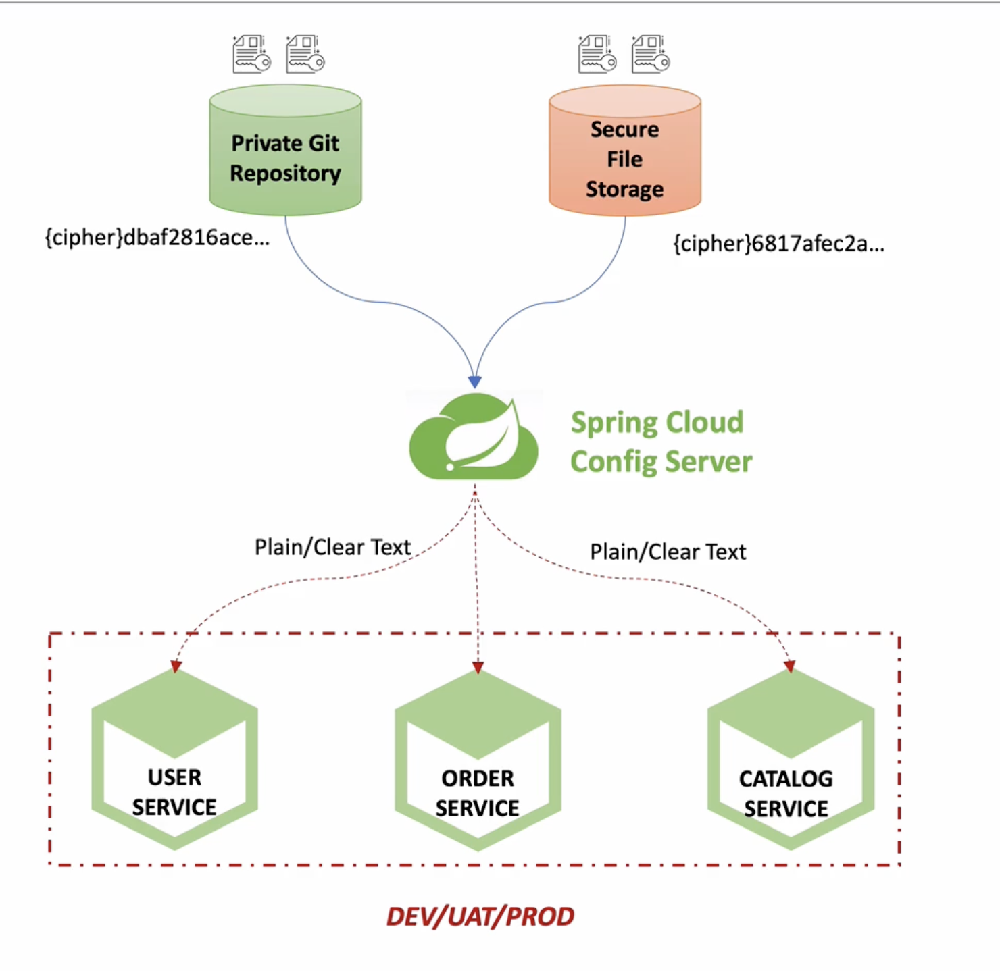
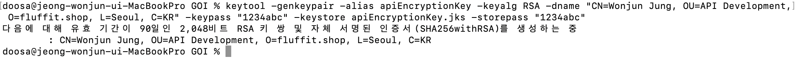

## Spring Cloud Config 사용시 설정값 암호화 방법

### 대칭키

- 공유된 같은 키를 가지고 암호화와 복호화를 모두 진행한다.
- 같은 키로 암호화와 복호화를 모두 진행하기에 해당 공유 키가 노출되었을 경우에 보안상 좋지 않다.

### 비대칭키

- 암호화할 때 쓰는 키와 복호화할 때 쓰는 키를 달리 해서 쓰는 방식
- 두 키 중 하나는 Public Key로, 나머지 하나는 Private Key를 사용한다.
- 자바에서는 이러한 Public Key와 Private Key를 생성하기 위해서 JDK안에 포함되어 있는 Keytool이라는 프로그램을 이용
- 주로 RSA알고리즘을 이용

### RSA알고리즘이란?

- RSA는 전 세계에서 가장 많이 사용되는 공개키 암호 알고리즘
- RSA 알고리즘은 소인수분해 문제가 어렵다는 사실에 기반한 알고리즘
    - 최소한 1024 bits 이상의 서로 다른 Prime Number p, q를 선택하고, 이를 이용하여 키를 생성
    - 1024 bits 이상으로 하는 이유는 보안상 현재 컴퓨팅파워로 풀 수 있는 소인수 분해 문제에 대한 제한 때문
- RSA 알고리즘은 Key Generation, Key Distribution, Encryption, Decryption 4개의 단계를 거친다.

### 사용법



### 1. 설정 파일 암호화를 위한 자바 key tool 사용법(비대칭키 생성 방법)

- keystore파일(jks) 생성

```bash
keytool -genkeypair -alias apiEncryptionKey -keyalg RSA -dname "CN=Wonjun Jung, OU=API Development, O=fluffit.shop, L=Seoul, C=KR" -keypass "ben0722" -keystore apiEncryptionKey.jks -storepass "ben0722"
```



| **-keypass** | Private Key의 비밀번호 | Private Key가 필요할때 사용 |
| --- | --- | --- |
| **-storepass** | 전체 jks파일 자체의 비밀번호 | jks 파일을 열어서 안에 어떤 키들이 있는지 보거나 조작하려고 할 때 필요한 비번 |
- keystore 상세 정보 확인

```bash
keytool -list -keystore apiEncryptionKey.jks -v
```

### 이전에 생성했던 키로부터 public key를 끄집어내올 수 있는 방법

- 생성된 키로부터 인증서를 추출

```bash
keytool -export -alias apiEncryptionKey -keystore apiEncryptionKey.jks -rfc -file trustServer.cer
```

- 인증서 파일을 다시 jks파일로 변환

```bash
keytool -import -alias trustServer -file trustServer.cer -keystore publicKey.jks
```

### 주의

- 자바8일때에는 위의 keytool을 사용하여 만든 jks파일을 통해 암호화, 복호화할 때 문제 발생
    
    
    
    - 위와 같은 key 사이즈의 제한으로 인한 오류나 지원되지 않는 알고리즘으로 인한 오류 발생
- 자바8일 경우에는 이에 오라클 사이트에서 Java Cryptography Extension(JCE)를 다운받아 jdk 경로안에 해당 jar파일을 복사하여 사용
- 자바8이상의 버전에서는 아무 문제 없음

### 2. Spring Cloud Config 프로젝트 파일 설정

- 우선 application.yml파일과 같은 레벨에 bootstrap.yml파일을 생성
    
    ```yaml
    encrypt:
      key-store:
        # location: file://${user.home}/Desktop/git/toy-msa/config-service/apiEncryptionKey.jks
        # Mac 또는 Linux용
        #location: file:/apiEncryptionKey.jks
        # Window용
        #location: file:apiEncryptionKey.jks
        location: file:./apiEncryptionKey.jks
        password: ${JKS_PWD}
        alias: ${JKS_ALIAS}
    ```
    

### 3. 설정 파일(jks이용한) 암호화 방법

- 암호화
postman으로 post방식으로 Body에 raw를 선택한 다음 Text형식으로 암호화 원하는 값 담아서 보내기

```
http://127.0.0.1:8888/encrypt
```

- 복호화
위와 같은 방식

```
http://127.0.0.1:8888/decrypt
```

**참고**

- https://gngsn.tistory.com/96
