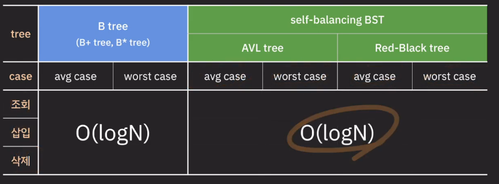

# DB인덱싱-B-트리

Status: Not started

## B tree의 개념과 데이터 삽입 동작

- 이진 트리
    - 좌 : 부모 노드보다 작음
    - 우: 부모 노드보다 큼
    
- 만약 자식 노드를 3개 이상으로 변경한다면? (B tree)
    
    
    
    - 각각이 범위를 갖게 됨.
    - 이를 위해 부모 노드에 key를 하나 이상 저장
        - key를 오름차순으로 정렬
        - 정렬된 순서에 따라 자녀 노드들의 key값의 범위가 결정
    - 자녀 노드 수를 자유롭게 결정하여 사용 가능
        - 자녀 노드의 갯수가 중요한 파라미터임.

- B tree
    - M : 각 노드의 최대 자녀 노드 수
        - M-1 : 각 노드의 최대 key 수
        - ceil(M/2) : 각 노드의 최소 자녀 노드 수
            - 단, root node, leaf node 제외
        - ceil(M/2) -1  : 각 노드의 최소 key 수
    
    - internal 노드의 key 수가 x개 라면  자녀 노드의 수는 언제나 x+1개이다.
    - 노드가 최소한 하나의 key는 가지기 때문에 몇 차 B tree인지와 상관 없이 internal 노드는 최소 두 개의 자녀를 가진다.

- B tree 데이터 삽입
    - 추가는 항상 leaf노드에서 한다.
    - 노드가 넘치면 가운데 key를 기준으로 좌우 key들은 분할하고 가운데 key는 승진한다.
    - 특징
        - 모든 leaf 노드는 같은 레벨에 있다.
        - balanced tree임
        - 검색 avg/worst case O(logN)

- B tree 데이터 삭제
    - 삭제도 항상 leaf노드에서 발생
    - 삭제 후 최소 key 수보다 적어졌다면 재조정한다.
        - 참고** : 예시는 데이터와 key가 동일한 상황이라 그래

---

### 왜 DB index로 B tree 계열이 사용 되는가?

- 비슷한 시간 복잡도의 알고리즘 말고  왜 B tree를 쓰는가?
    - secondary storage (SSD, HDD)
        - 데이터 처리 속도가 느리다.
        - 용량이 가장 크다
        - block 단위로 데이터를 읽고 쓴다
            - block : 4kb, 8kb… file system이 데이터를 읽고 쓰는 논리적인 단위
                - 불필요한 자료를 읽어오는 단점
                - 연관된 데이터를 모아서 저장하면 더 효율적으로 읽고 쓸 수 있음.
        
        ⇒ secondary storage에 최대한 적게 접근하는 것이 성능 면에서 좋다.

    - 탐색 범위
        
        
        
        - 탐색 범위를 빠르게 좁힐 수 있다.
        - 노드를 하나 읽어온다고 해도 결국 block을 읽어옴
            - 따라서 데이터 1개 =/= 1개 불러옴
            - 따라서 B tree 알고리즘이 이득
    
- B tree의 강력함
    - Best Case
        
        
        
    - Worst Case
        
        
        
    - 낮은 높이로 많은 수의 데이터 담을 수 있음.
        - root 노드에서 가장 멀리 있는 데이터도 세 번의 이동만으로 접근 가능
    
- hash index는?
    - 삽입/삭제/조회의 시간복잡도는 O(1)
    - but 조회만 가능(equality)
    - 범위 기반 검색이나 정렬에는 사용될 수 없음.

---

## 인덱스 종류

### 클러스터링 인덱스

- 리프 페이지 = 데이터 페이지
- 실제 데이터 자체가 정렬된 것
- 테이블 당 1개만 존재
- 아래의 제약 조건 시 자동 생성
    - PK
    - unique + not null

### 논 클러스터링 인덱스

- 별도의 인덱스 페이지 생성 (공간 요구됨)
- 리프 페이지에 실제 데이터 페이지 주소 담음
- 직접 index 생성시 만들어짐
- unique 제약 조건 적용하면 자동 생성

### 다수의 인덱스는 어떻게 동작하는가?

- 인덱스 주소는 값이 추가/삭제 될 경우 변경되기 때문에 클러스터링 인덱스가 연결되어 있음.

### 카디널리티

- 중복 수치가 낮은 (카디널리티가 높은)
    - 중복수치가 낮은 데이터를 기반으로 인덱스를 설정하는 것이 좋다.

---

참고자료

https://www.youtube.com/watch?v=edpYzFgHbqs