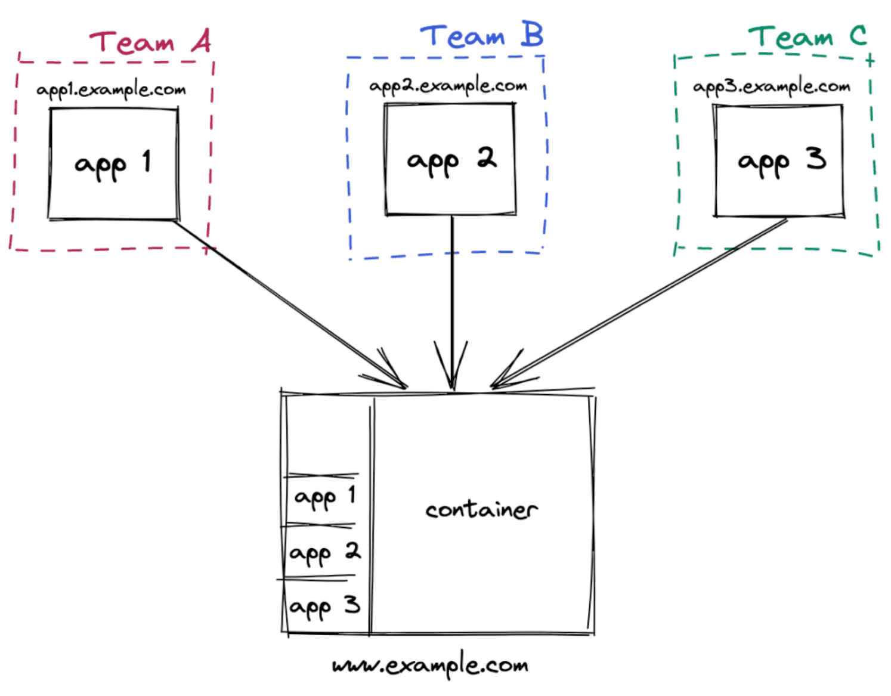
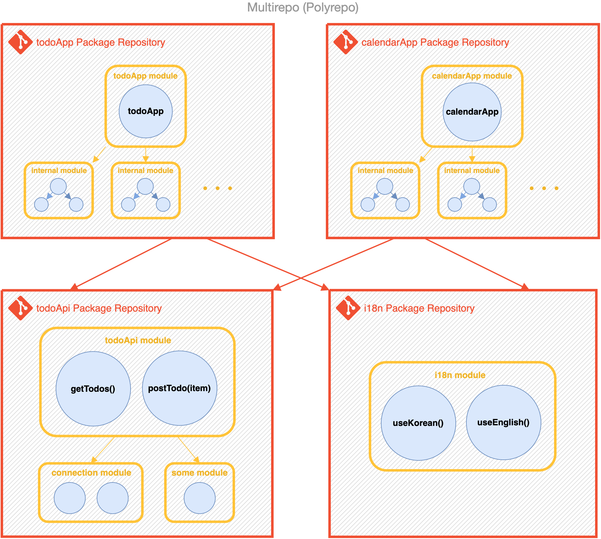
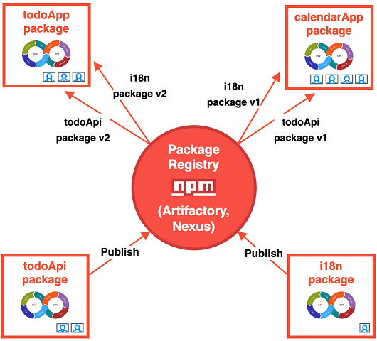
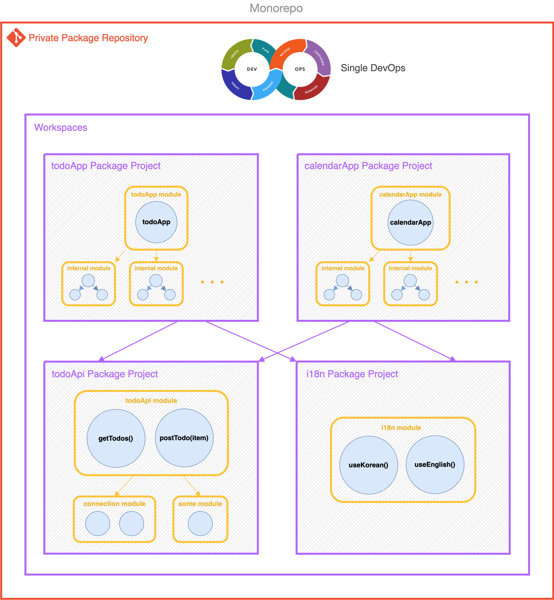
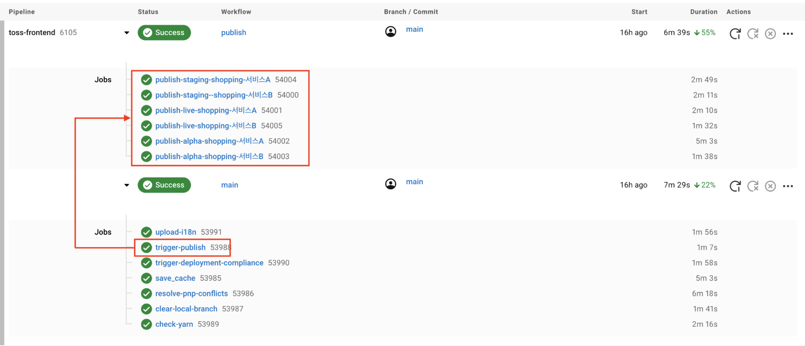
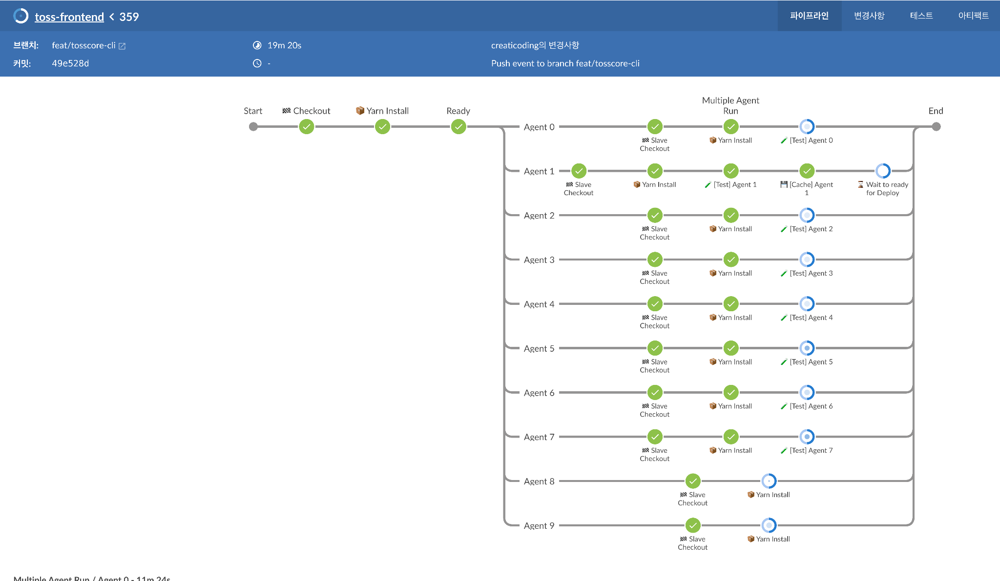

# 모노 레포

Date: September 3, 2024
Status: In progress
Categories: Back-study:cs-study
Tags: CI/CD, CS학습, Frontend

## 모노레포란?

- 모노레포
    - 모든 프로젝트에 대한 코드와 자산을 저장하는 단일 저장소를 말함.
    - 배포 주기와 저장소의 강력한 결합 발생
    
    
    

- 멀티레포
    - 여러 저장소 사용
    - 일반적으로 많이 선택되고 있는 모델
        - 팀별 / 프로젝트별로 나누어 멀티 레포 방식으로 개발
    
    
    

### 모노레포의 등장 배경

- 모노레포
    - 버전 관리 시스템에서 두 개 이상의 프로젝트 코드가 동일한 저장소에 저장되는 소프트웨어 개발 전략
    
    ⇒ 모놀리식 애플리케이션의 한계에 대한 비판에서 출발
    

- 모놀리식 애플리케이션의 한계
    
    
    
    - 모듈화 없이 설계된 소프트웨어 애플리케이션을 뜻함.
        
        ⇒ 코드가 직접적으로 의존하면서 하나의 버전으로 관리됨. (관심 분리 x) 
        
        cf) 아키텍쳐 상의 모놀리는 마이크로 서비스와의 대비된 형태
        
        
        
        - FE에서는?
            - 모놀리스 FE 아키텍처
            
            
            
            - 마이크로 FE 아키텍처
            
            
            
    
    - 모듈화를 통해 한계를 해소하고자 노력
        
        
        
        ⇒ 이러한 모듈화에서 공통으로 활용되는 모듈의 소스를 위치 시키기 위해 레포를 분리함.
        

- 멀티 레포 ( = 폴리 레포)
    
    
    
    - 팀의 자율성 보장
    - 개발 라이프 사이클의 자체적 통제 가능
    
    BUT ⇒ 이는 고립 및 협업을 방해
    
- 멀티 레포의 문제
    - 프로젝트 생성의 번거로움
    - 패키지 중복 코드 가능성
    - 관리 포인트 증가
    - 일관성 없는 개발자 경험
    - 다른 패키지의 변경사항 파악 어려움
    - 교차 저장소의 리팩터링 비용
    
    
    

### 모노레포를 통한 문제 해결 전략

- 모노레포의 특징
    - 두 개 이상의 프로젝트가 동일한 저장소에 저장됨
    - 프로젝트 사이의 의존성이 존재하거나 같은 제품군이거나 하는 정의된 관계 확인 가능
        
        ⇒ 모노 레포 관리 도구를 통해 관계를 효율적으로 관리함.
        
- 위에서 언급된 문제들을 해결.

---

### 모노레포 사용시 주의 할 점

- 모노레포의 프로젝트들을 분리해서 접근하고 / 권한 등을 관리할 수 있도록 툴이 필요하다.

- 관리 측면
    - 코드 공유가 가능해야한다.
    - 일관성 있는 도구 : 서로 다른 프레임워크를 사용해도 일관된 개발 경험 제공이 가능해야 한다.
    - 스케폴딩 : 새로운 프로젝트를 생성할 때 초기 코드가 쉽게 생성되어야 한다.
    - 프로젝트 제약 및 가시성 : 저장소 내에 의존관계 제한하는 규칙 정의 지원 / 팀 전용 혹은 프레임 워크 제한 등
- 속도 측면
    - 로컬 캐싱 - 같은 것을 두 번 빌드하지 않도록
    - 분산 캐싱 : 조직 단위 여러 CI 환경에서 같은 것을 두 번 빌드, 테스트 하지 않도록 관리
    - 로컬 작업 오케스트레이션 : 빌드 및 테스트 등의 작업을 순서에 맞게 병렬로 실행
    - 분산 작업 실행 : 단일 시스템 실행 → 여러 시스템에 명령 전달 가능해야
    - 변화에 영향 받는 프로젝트 범위 감지
- 구조파악 측면…
    - 워크스페이스 의존성 관계 분석
    - 의존성 그래프 시각화…

- 예시 : 배포 과정의 최적화
    - 모든 배포를 독립된 컴퓨팅 환경에서 병렬적으로 진행
        
        CircleCI 
        
        
        
        
        
    - Jenkins 를 통해서도 동적으로 파이프라인 구성
        
        
        

---

https://toss.tech/article/monorepo-pipeline

https://d2.naver.com/helloworld/0923884

https://green-labs.github.io/monorepo-microfrontend

https://medium.com/musinsa-tech/journey-of-a-frontend-monorepo-8f5480b80661

https://www.techtarget.com/whatis/definition/monolithic-architecture

https://d2.naver.com/helloworld/7553804