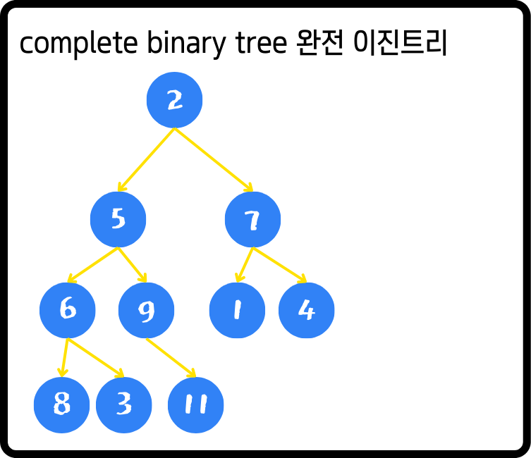
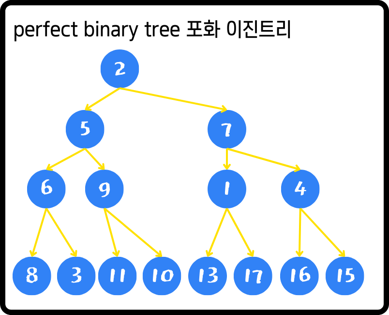
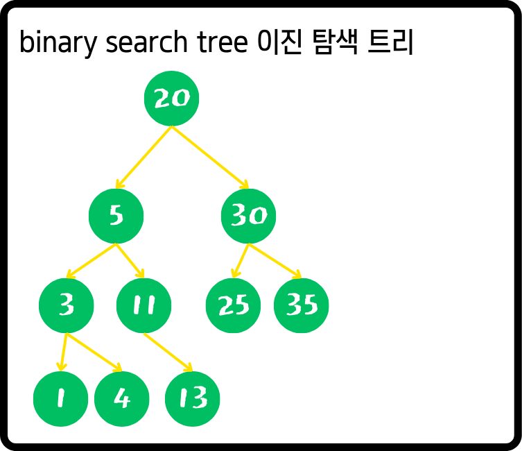
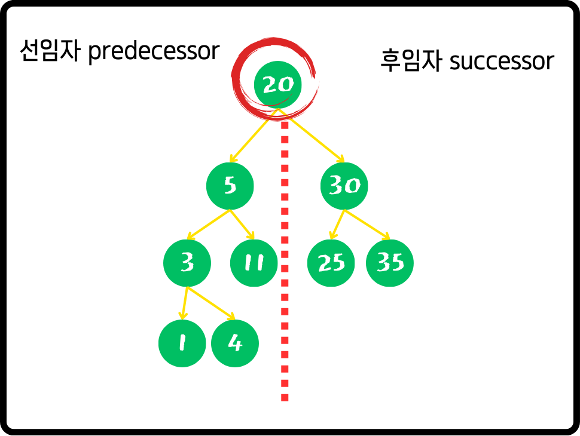
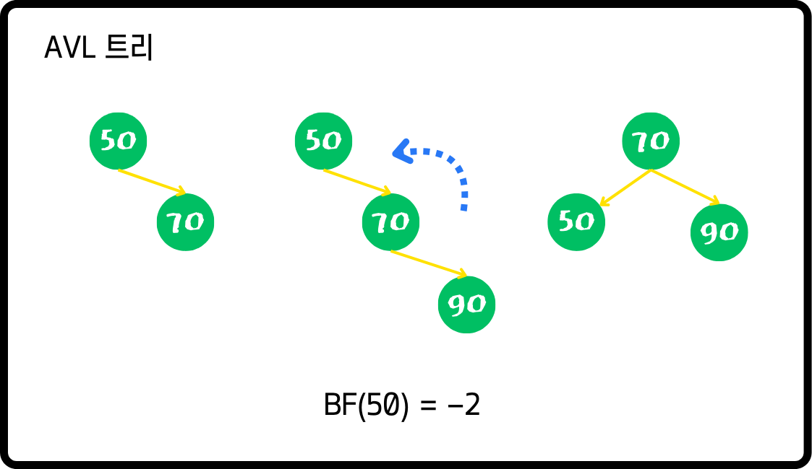

# 트리

## 트리 기본 개념

### 트리의 정의

- 트리 (tree)
    - 노드(node)들의 집합
    - 구성요소
        - 값(value) + 다른 노드를 가리키는 레퍼런스들로 구성 (구현 관점)

### 트리의 주요 용어

- 간선(edge)
    - 노드와 노드를 연결하는 선
    - 구현 관점에서 보면 → 이것은 레퍼런스를 의미함.
    - aka. link / edge
    
- 루트 노드 (root)
    - 최상단
    - 시작점
- 자녀 노드 (child)
    - 모든 노드는 0개 이상의 자녀 노드를 가진다.
- 부모 노드 (parent)
    - 자녀 노드를 가지는 노드
- 형제 노드 (sibling)
    - 같은 부모를 가지는 노드

- 조상 노드 (ancestor)
    - 부모 노드를 따라 루트 노드까지 올라가면서 만나는 모든 노드
- 자손 노드 (descendant)
    - 자녀 노드를 따라 내려가면 만날 수 있는 모든 노드

- 내부 노드 (internal)
    - 자녀 노드를 가지는 노드
    - aka. branch node, inner node
    - 결국 모든 부모 노드
- 외부 노드
    - 자녀 노드가 없는 노드
    - aka. leaf node, outer node
    - 단말 노드 (terminal node)

- 경로
    - 한 노드에서 다른 노드 사이의 노드들의 시퀀스(sequence)
    
- 노드의 높이(height)
    - 노드에서 리프(leaf) 노드까지의 가장 긴 경로의 간선(edge) 수
    - 간혹 노드 단위로 높이를 세는 곳도 있어 확인이 필요함.
- 트리의 높이(height)
    - 루트 노드의 높이

- 노드의 깊이(depth)
    - 루트노드에서 해당 노드까지 경로의 간선 수
- 트리의 깊이(depth)
    - 트리에 있는 노드들의 깊이 중 가장 긴 깊이
    - 트리의 높이 = 트리의 깊이

- 노드의 차수
    - 노드의 자녀 노드 수
- 트리의 차수
    - 트리에 있는 노드들의 차수 중 가장 큰 차수

- 두 노드 사이의 거리 (distance)
    - 두 노드의 최단 경로의 간선 수

- 노드의 레벨
    - 노드와 루트 노드 사이의 경로에서 간선의 수
    - 루트 노드의 레벨이 0인가 1인가 확인이 필요함.
- width
    - 임의의 레벨에서 노드의 수
- 노드의 크기(size)
    - 자신을 포함한 자손 노드의 수
- 서브 트리
    - 각 노드의 자녀 노드들을 재귀적으로 서브트리를 구성한다.

### 트리 구조의 주요 특징

- 루트 노드는 하나만 존재한다.
- 사이클이 존재하지 않음.
- 자녀 노드는 하나의 부모 노드만 존재.
- 데이터를 순차적으로 저장하지 않는 비선형 구조
- 트리에 서브 트리가 있는 재귀적 구조
- 계층 적 구조

### 이진 트리 (binary 트리)

- 각 노드의 자녀 수가 최대 2인
- left / right child 존재

- 형태에 따른 이진 트리 구분
    - full binary tree
        - 모든 노드는 자녀 노드가 없거나 2개인 트리
            
            
            
        
    - complete binary tree 완전 이진 트리
        - 마지막 레벨을 제외한 모든 레벨에서 노드가 빠짐 없이 채워져 있음
        - 마지막 레벨은 왼쪽부터 빠짐 없이 노드가 채워져 있는 트리.
            
            
            
        
    - 포화이진 트리 perfect binary tree
        - 모든 레벨에서 노드가 빠짐 없이 채워진 트리
            
            
            
        
    - 변질 이진 트리 degenerate binary tree
        - 모든 부모 노드가 하나의 자녀 노드만 가지는 트리
        - left skewed binary tree
        - right skewed binary tree
    - 균형 이진 트리 balanced binary tree
        - 모든 노드에서 왼쪽 서브 트리와 오른쪽 서브 트리의 높이 차이가 최대 1인 트리
        
        
        
        
        

## 이진 탐색 트리

### 이진 탐색 트리의 정의

- 이진 탐색 트리
    - 모든 노드의 왼쪽 서브 트리는 해당 노드의 값보다 작은 값들만 가지고 모든 노드의 오른쪽 서브 트리는 해당 노드의 값보다 큰 값들만 가진다.
    - Value에 관한 규칙
        
        
        

### 이진 탐색 트리 순회

- 중위 순회 inorder traversal
    - 재귀적으로 왼쪽 서브 트리 순회 → 현재 노드 → 재귀적으로 오른쪽 서브 트리 순회
    - 위의 그림에서
        
        1 → 3 → 4 → 5 → 11 → 13 → 20 → 30 → 25 → 35
        
    - 좌측에서부터 순서대로 위치한 노드를 따라간다고 생각하면 됨.
    
- 전위 순회 preorder traversal
    - 현재 노드 → 재귀적 왼쪽 서브 트리 → 재귀적 오른쪽 서브 트리
    - 위의 그림에서
        
        20 → 5 → 3 → 1 → 4 → 11→ 13 → 30 → 25 → 35
        
- 후위 순회 postorder traversal
    - 재귀 왼쪽 → 재귀 오른쪽 → 현재 노드
    - 위의 그림에서
        
        1→ 4 → 3 → 13 → 11 → 5 → 25 → 35 → 30 → 20
        

### 노드의 선임자/후임자

- 노드의 후임자 (successor)
    - 해당 노드보다 값이 큰 노드 중에서 가장 값이 작은 노드
- 노드의 선임자 (predecessor)
    - 해당 노드보다 값이 작은 노드 중에서 가장 값이 큰 노드

### 이진 탐색 트리의 삽입/삭제/검색

|  | best | avg | worst |
| --- | --- | --- | --- |
| insert | **θ(1)** | O(logN) | **θ(N)** |
| delete | **θ(1)** | O(logN) | **θ(N)** |
| search | **θ(1)** | O(logN) | **θ(N)** |
- 트리가 한쪽으로 편향되면 삽입/삭제/검색 등등 여러 동작들의 수행 시간이 악화된다.
- 이진 균형 트리 / AVL 등이 등장

## AVL 트리

- AVL 트리
    - 이진탐색 트리의 한 종류
    - 스스로 균형을 잡는 트리
    - balance factor
- Balance factor
    - 임의의 노드 x에 대해서
        
        왼쪽 서브트리의 높이와 오른쪽 서브트리 높이의 차
        

- 균형잡기
    - 트리에 삽입 혹은 삭제 후
        
        `BF(x)` 가 `{-1, 0, 1}` 가 아닐 경우 균형을 맞추는 작업 수행
        

### AVL 트리의 삽입/삭제/검색

|  | best | avg | worst |
| --- | --- | --- | --- |
| insert | **θ(1)** | O(logN) | O(logN) |
| delete | **θ(1)** | O(logN) | O(logN) |
| search | **θ(1)** | O(logN) | O(logN) |
- 단, 균형이 깨졌을때 → 재조정 자체가 시간이 소요됨. ⇒ 이걸 해결하기 위해 red-black 트리

