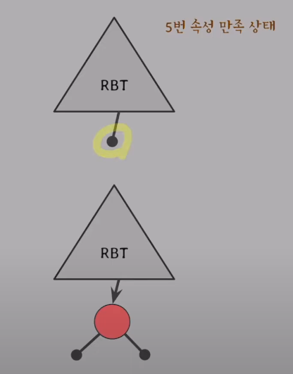
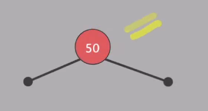
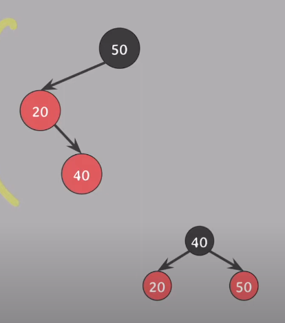
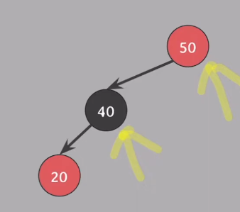
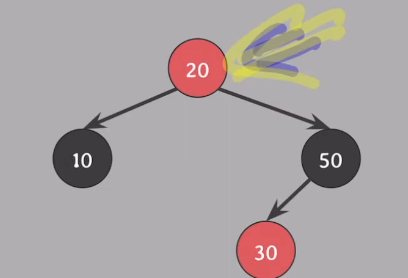
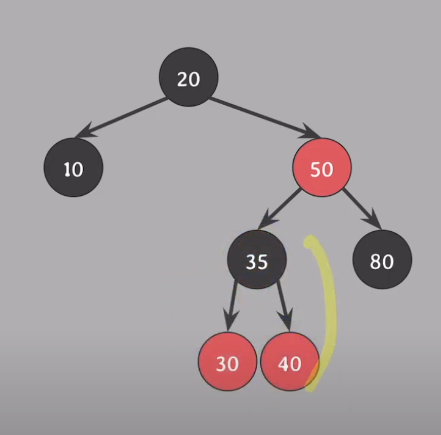
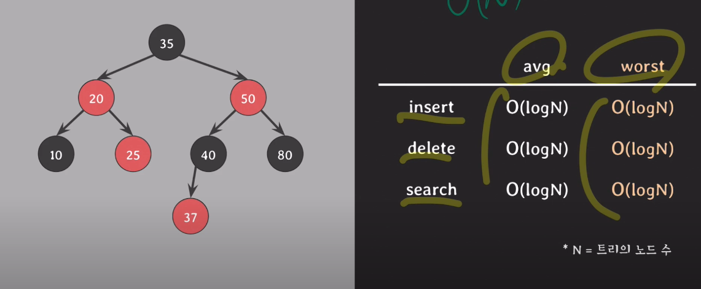
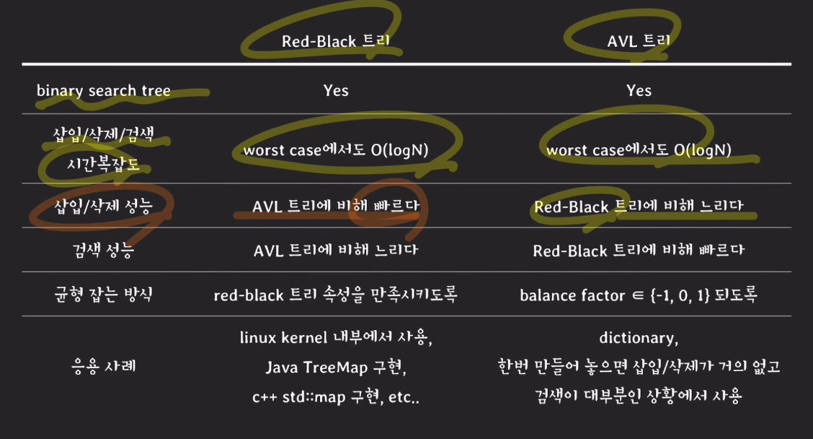

# 레드블랙트리 red-black-tree

## RED-Black 트리

- 레드 블랙 트리
    - 스스로 균형을 잡는 트리 (balancing)
    - BST의 worst case의 단점을 개선
    - 모든 노드는 red 혹은 black

- 레드 블랙 트리 속성
    1. 모든 노드는 red 혹은 black
    2. 루트 노드는 black
    3. 모든 nil 노드는 black
        - RB 트리에서 leaf 노드는 nil 노드 (자녀가 없는 노드는 모두 nil 노드)
    4. red의 자녀들은 black 
        
        = red가 연속적으로 존재할 수 없다.
        
    5. 임의의 노드에서 자손 nil 노드들까지 가는 경로들의 black 수는 같다.
        - 자기 자신은 카운트에서 제외

- 노드 X의 black height
    - 노드 X에서 임으의 자손 nil 노드까지 내려가는 경로에서의  black 속성

- 색을 바꾸면서도 5번 속성 유지하기
    
    
    
    - 조건
        - 5번 속성 만족
        - 두 자녀가 같은 색을 가지면
        - 부모와 두 자녀 색을 바꿀때
    
    ⇒ 여전히 5번 속성 만족시킴.
    

### RB 트리 균형 잡기

- 삽입 삭제 시
    - 주로 4, 5번을 위반 → 이것의 균형을 잡아줌

- 삽입
    - 삽입 전 : RB 트리 속성 만족
    - 삽입 방식 : 일반적인 BST와 동일
    - 삽입 후 : RB 트리 위반 여부 확인
        - 위반했다면 재조정
        - 재조정 후 만족하는 트리 확인

- 삽입 노드
    - 삽입 노드는 무조건 RED
        - 삽입 후에도 5번 속성을 만족하기 위해.
            
            (5) 임의의 노드에서 자손 nil 노드들까지 가는 경로들의 black 수는 같다.

    
    

### RB 트리 삽입해보기

1. `insert(50)`
    
    
    
    - 비충족 조건
        
        (2) 루트 노드는 black
        
    - 충족할 수 있도록 변환
        - 루트 노드를 black으로 변환
        
        
        

1. `insert(20)`
    
    
    

*이 이후에는 nil이 그림에 없으나 nil이 있다고 가정!*

1. `insert(10)`
    
    
    
    - 비충족 조건
        
        (4) 노드가 red라면 자녀들은 black
        
    - 충족할 수 있도록 변환
        - 색상만 본다면 → 기울어진 균형 관계에서 red를 하나 옆으로 이동하기.
            
            
            
            - 단, 바이너리 트리 유지되어야 함.
            - 따라서 BST의 회전 사용할 것
                
                
                
        - 어떻게 회전을 사용할 것인가?
            - 20과 50 색을 바꿔준다
            - 50을 기준으로 오른쪽으로 회전한다.
            
            

    - 정리
        - 삽입된 red 노드가
            - 부모의 왼쪽 자녀
            - 부모도 RED고 할어버지의 왼쪽 자녀
            - 삼촌은 black이라면 이라면
            
            할아버지 기준으로 오른쪽으로 회전하면 된다.

1. `insert(40)`
    
    
    
    - 비충족 조건
        
        (4) 노드가 red라면 자녀들은 black
        
        ⇒ 위의 case와 약간 다름
        
    - 우선적으로
        - 꺾인 것을 해결 → 20을, 기준으로 왼쪽으로 회전
            
            
            
            ⇒ 이러면 위으 `insert(50)` 케이스 중간과 유사한 형태가 됨.
            
            ⇒ 50 기준 오른쪽으로 회전할 것
            
    
2. `insert(30)`
    
    
    
    - 비충족 조건
        
        (4) 노드가 red라면 자녀들은 black
        
    - 해결 방안
        
        
        
    - 비충족 조건
        
        (2) 루트 노드는 black
        
    - 해결 방안
        - root를 바꿔주기
        
        
        

---

### 삽입 예제 (순서대로)

- start
    
    
    
- `insert(80)`
    
    
    
- `insert(40)`
    
    
    
    ⇒ 부모-삼촌 : RED → BLACK
    
    
    
    - 만족! OK
- `insert(35)`
    
    
    
    - 한쪽으로 치우친 트리로 변환해주기
        
        40 기준 회전
        
        
        
    - `30` ↔ `35` 색상 변경
        
        
        
    - `30` 기준 회전
        
        
        

---

### 삭제 방식

---

### 결론

- 삽입 삭제 성능
    - RB TREE  > AVL 트리
        - 삽입 삭제에 있어서 밸런스 잡는 과정의 코스트가 더 적다
- 검색 성능
    - AVL 트리 > RB Tree
        - 밸런스가 더 잘 잡혀 있기 때문에 AVL 트리가 더 빠르긴 함 (작음)