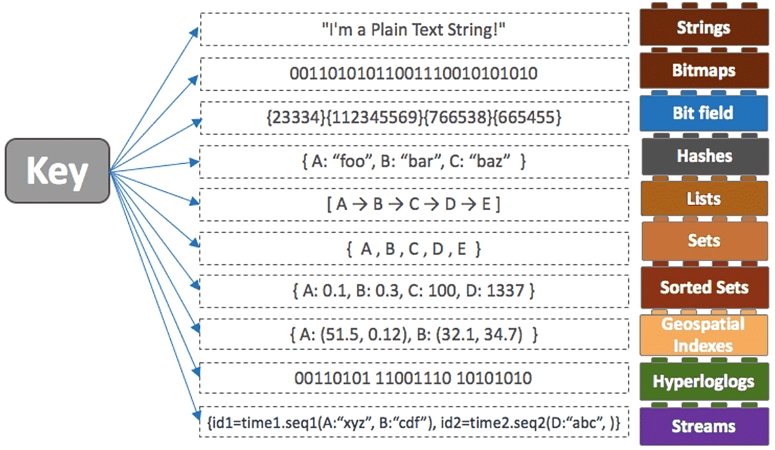
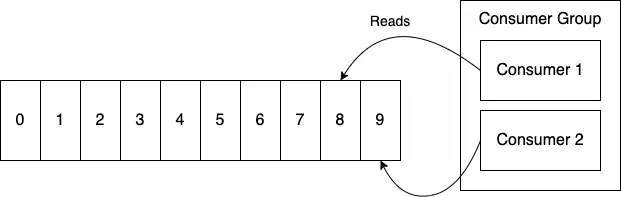

# Redis 자료구조 알아보기(feat.Redis Stream)

Redis 공식 docs를 읽고 기본적인 개념을 정리하였습니다.

### Redis를 사용하는 방식

- Data structure store
    - 일반적으로 사용하는 방법
    - `Redis as an in-memory data structure store`
- Document database
    
    ```json
    {
      "brand": "brand name",
      "condition": "new | used | refurbished",
      "description": "description",
      "model": "model",
      "price": 0
    }
    ```
    
- Vector database
    - 벡터 데이터베이스
        - 비정형 데이터
        - 벡터 : 데이터 내부의 복잡한 패턴과 의미를 포착하여 저장 및 조작 / 이해하는데 활용.
        - 데이터를 벡터 공간에 매핑함으로써 의미를 기준으로 유사한 항목들이 가까이 위치
    - LangChain
        - LLM을 사용하는 애플리케이션을 위한 오픈 소스 프레임워크
        - openGPT와 연결하는 지점 ⇒ (Session, vector db for RAG…등)으로 사용
        

### **Redis data types**

- String
    - 가장 기본적인 Redis 데이터 타입
    - 바이트 시퀀스를 나타냄
    
    ```xml
        > SET bike:1 Deimos
        OK
        > GET bike:1
        "Deimos"
    ```
    
    ```java
    package io.redis.examples;
    
    import redis.clients.jedis.UnifiedJedis;
    import redis.clients.jedis.params.SetParams;
    
    import java.util.ArrayList;
    import java.util.Arrays;
    import java.util.List;
    
    public class StringExample {
      public void run() {
        try (UnifiedJedis jedis = new UnifiedJedis("redis://localhost:6379")) {
    
          String res1 = jedis.set("bike:1", "Deimos");
          System.out.println(res1); // OK
          String res2 = jedis.get("bike:1");
          System.out.println(res2); // Deimos
    
          Long res3 = jedis.setnx("bike:1", "bike");
          System.out.println(res3); // 0 (because key already exists)
          System.out.println(jedis.get("bike:1")); // Deimos (value is unchanged)
          String res4 = jedis.set("bike:1", "bike", SetParams.setParams().xx()); // set the value to "bike" if it
          // already
          // exists
          System.out.println(res4); // OK
    
          String res5 = jedis.mset("bike:1", "Deimos", "bike:2", "Ares", "bike:3", "Vanth");
          System.out.println(res5); // OK
          List<String> res6 = jedis.mget("bike:1", "bike:2", "bike:3");
          System.out.println(res6); // [Deimos, Ares, Vanth]
    
          jedis.set("total_crashes", "0");
          Long res7 = jedis.incr("total_crashes");
          System.out.println(res7); // 1
          Long res8 = jedis.incrBy("total_crashes", 10);
          System.out.println(res8); // 11
    
        }
      }
    }
    
    ```
    
- List
    - 삽입 순서대로 정렬된 문자열 리스트
    - head, tail 접근은 O(1) 그러나 리스트 내의 요소를 건드릴 때는 O(n)
    - Linked List 구조로 이루어짐 (Array x)
        
        <aside>
        
        Redis lists are implemented via Linked Lists. This means that even if you have millions of elements inside a list, the operation of adding a new element in the head or in the tail of the list is performed *in constant time*. The speed of adding a new element with the [**`LPUSH`**](https://redis.io/docs/latest/commands/lpush/) command to the head of a list with ten elements is the same as adding an element to the head of list with 10 million elements.
        
        </aside>
        
    - 일반적인 사용 사례
        - 사용자가 소셜 네트워크에 게시한 최신 업데이트를 기억하는 것.
        - 프로듀서-컨슈머 패턴을 사용한 프로세스 간 통신에서, 프로듀서가 항목을 리스트에 추가하고, 컨슈머(주로 작업자)가 해당 항목을 소비하여 작업을 수행하는 것.
    
    ```java
    > LPUSH bikes:repairs bike:1
    (integer) 1
    > LPUSH bikes:repairs bike:2
    (integer) 2
    > RPOP bikes:repairs
    "bike:1"
    > RPOP bikes:repairs
    "bike:2"
    
    > LPUSH bikes:repairs bike:1
    (integer) 1
    > LPUSH bikes:repairs bike:2
    (integer) 2
    > LPOP bikes:repairs
    "bike:2"
    > LPOP bikes:repairs
    "bike:1"
    
    > LPUSH bikes:repairs bike:1
    (integer) 1
    > LPUSH bikes:repairs bike:2
    (integer) 2
    > LPOP bikes:repairs
    "bike:2"
    > LPOP bikes:repairs
    "bike:1"
    ```
    
- Set
    - 고유한 문자열로 이루어진 순서가 없는 컬렉션
    - 자바의 `HashSet` 과 유사
    - 요소 추가/제거/존재여부 확인 O(1) 시간 내에 가능
        
        ⇒ Hash구조를 통한 최적화로 가능함.
        
    - 일반적 사용 사례
        - 고유한 항목 추적
        - 관계 표현
        - 집합 연산 수행
    - 큰 데이터 집합을 사용할 경우 일반적인 방식의 Set 탐색 방식은 다소 오래 걸릴 수 있음.
        - Bloom filer / Cuckoo filter를 고려해볼 수 있다. (정확도 이슈 있음)
    
    ```java
    > SADD bikes:racing:france bike:1
    (integer) 1
    > SADD bikes:racing:france bike:1
    (integer) 0
    > SADD bikes:racing:france bike:2 bike:3
    (integer) 2
    > SADD bikes:racing:usa bike:1 bike:4
    (integer) 2
    
    > SISMEMBER bikes:racing:usa bike:1
    (integer) 1
    > SISMEMBER bikes:racing:usa bike:2
    (integer) 0
    
    ```
    
- Hash
    - 필드-값 쌍의 컬렉션으로 모델링 된 레코드
    - 자바의 `HashMap` 과 유사
    - 필드 만료 지원
        - 특정 필드에 정확한 만료 시간 혹은 TTL 값을 설정 가능.
        - 사용 사례
            - 이벤트 추적 : 지난 시간 동안 발생한 기록 추적
            - 고객 세션 관리
            - 활성 세션 추적
    
    ```java
    > HSET bike:1 model Deimos brand Ergonom type 'Enduro bikes' price 4972
    (integer) 4
    > HGET bike:1 model
    "Deimos"
    > HGET bike:1 price
    "4972"
    > HGETALL bike:1
    1) "model"
    2) "Deimos"
    3) "brand"
    4) "Ergonom"
    5) "type"
    6) "Enduro bikes"
    7) "price"
    8) "4972"
    
    > HINCRBY bike:1 price 100
    (integer) 5072
    > HINCRBY bike:1 price -100
    (integer) 4972
    ```
    
- Sorted Set
    - 각 문자열에 대한 score에 따라 순서를 유지하는 컬렉션
    - 사용 예시
        - ranking board : 손쉽게 데이터에 score 값을 할당하여 정렬 유지 가능
        - rate limiter : 요청 기록 시간 순 정렬 → 슬라이딩 윈도우 방식 등을 통해 접근 제한 가능.
    
    ```java
    > ZADD racer_scores 10 "Norem"
    (integer) 1
    > ZADD racer_scores 12 "Castilla"
    (integer) 1
    > ZADD racer_scores 8 "Sam-Bodden" 10 "Royce" 6 "Ford" 14 "Prickett"
    (integer) 4
    
    > ZRANGE racer_scores 0 -1
    1) "Ford"
    2) "Sam-Bodden"
    3) "Norem"
    4) "Royce"
    5) "Castilla"
    6) "Prickett"
    > ZREVRANGE racer_scores 0 -1
    1) "Prickett"
    2) "Castilla"
    3) "Royce"
    4) "Norem"
    5) "Sam-Bodden"
    6) "Ford"
    
    > ZRANGEBYSCORE racer_scores -inf 10
    1) "Ford"
    2) "Sam-Bodden"
    3) "Norem"
    4) "Royce"
    ```
    

- Streams
    - 추가 전용 로그와 같은 방식으로 작동
    - 발생 순서대로 이벤트 기록 → 처리할 수 있도록 전파
- Geospatial Indexes
    - 주어진 지리 반경이나 경계 상자 내의 위치를 찾는데 유용
- Bitmaps
    - 문자열에 대해 비트 단위 연산 수행이 가능하도록 함.
- Bitfields
    - 문자열 값 내에 여러 카운터를 효율적으로 인코딩 가능함.



### Redis Streams

- 개념
    - 추가 전용 로그 처럼 동작 하는 데이터 구조
        - 일반적인 로그보다 복잡한 요소들을 구현 가능하도록 지지
        - O(1) 시간 복잡도의 데이터 엑세스
            - 각 항목에 대해 고유 ID를 할당(타임스탬프 기반→ 순차 생성)
                - ID를 통해 빠른 접근 가능.
        - 하나의 스트림을 여러개의 Consumer가 동시에 처리 가능함.
            - 해당 스트림의 값을 consumer가 읽고처리 가능 (like KAFKA)
            
            
            
            
            
            얘는 카프카의 처리 - 파티션이 있다. Stream은 없음!
            
        
        
        
    
    - 사용처
        - **이벤트 소싱** (예: 사용자 행동, 클릭 등을 추적)
        - **센서 모니터링** (예: 현장에서 장치로부터의 데이터 수집)
        - **알림 관리** (예: 각 사용자의 알림 기록을 별도의 스트림에 저장)

- Consumer 개념
    - 스트림에 새 항목이 추가되면 해당 스트림에서 데이터를 기다리고 있는 **모든 consumer에게 전달**
    - Stream에는 메시지가 무기한으로 추가됨
        
        **↔ Pub/Sub**에서는 메시지가 "발송 후 잊기"(fire and forget)
        
        ↔ `BRPOP` 과 같은 블로킹은 클라이언트가 모두 다른 값을 반환하는 것을 목표로함.
        
        ⇒ Consumer은 읽은 위치를 기록하고 있으며 → 이후 그 위치부터 다시 읽을 수 있음. (휘발 x)
        
    - Consumer 그룹 설정을 통한 Stream 내 다른  데이터 처리 가능
        - 대기 중 항목 / 처리되지 않은 메시지에 대한 기록 등을 별도로 관리 가능.
    
    

-------
### 출처 및 참고자료
https://redis.io/docs/latest/develop/data-types/
https://redis.io/solutions/vector-database/
https://dev.gmarket.com/113
https://mattwestcott.org/blog/redis-streams-vs-kafka
https://chanhan.tistory.com/entry/Redis-Redis레디스의-자료구조
https://estuary.dev/redis-data-types/