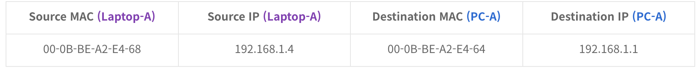
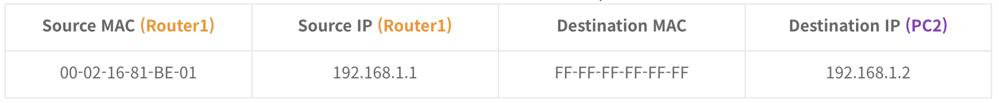
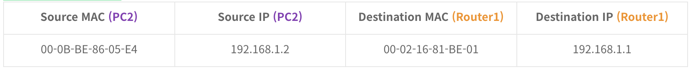

## ARP란?

- OSI 7계층에서 Layer 3(네트워크 계층)에 위치한 프로토콜로써 네트워크 상에서 IP주소를 MAC주소로 대응시키기 위해 사용되는 프로토콜이다.
- **MAC 주소란?**
    - 데이터 링크 계층에서 통신을 위한 네트워크 인터페이스에 할당된 고유 식별자로 Network Interface Card(NIC)를 가진 단말이라면 공장에서 출고될 때 부여되는 고유한 주소를 의미
    - LAN(Local Address Network)에서 목적지와 통신하기 위한 실질적인 주소가 바로 MAC 주소
- IP주소와 MAC주소를 일대일 대응하여 테이블로 정리하게 되는데, 이를 **ARP Table**

## ARP Header

- **Opcode** : ARP 패킷이 요청(Request) 또는 응답(Reply)에 따라 값이 바뀌게 되고 요청의 경우 1, 응답의 경우 2가 세팅
- **Source Hardware Address** : 출발지 MAC 주소
- **Source Protocol Address** : 출발지 IP 주소
- **Destination Hardware Address** : 목적지 MAC 주소
- **Destination Protocol Address** : 목적지 IP 주소

## ARP 동작과정

### 동일한 LAN(네트워크) 환경

1. 192.168.1.0/24 네트워크 전체에게 아래와 같은 ARP Request를 보낸다.
    
    
    
2. Switch-A는 PC-A의 ARP Request 패킷을 받고 PC-A의 MAC 주소를 테이블에 기록한다. 만약 스위치의 ARP 테이블에 192.168.1.4의 MAC 주소가 없다면, 이 패킷을 네트워크 전체에 브로드캐스팅한다.
3. PC-B와 PC-C는 자신이 192.168.1.4/24가 아니므로 이 ARP Request 를 폐기
4. Laptop-A는 자신이 192.168.1.4/24이므로 자신의 ARP 테이블에 PC-A의 MAC 주소를 기록하고, 자신의 MAC 주소를 알려주기 위해 아래와 같은 정보를 담아서 ARP Response 패킷을 전달한다.
    
    
    
5. Switch-A는 다시 Laptop-A의 MAC 주소를 ARP테이블에 기록하게되고, 이 정보를 PC-A로 전달한다.

### 다른 LAN 환경에 있는 PC끼리의 통신

- 모든 단말들은 자신만의 **Routing Table**이 있어 자신이 보내려는 패킷의 목적지 IP가 자신이 소속된 IP 대역인지 아닌지 알 수 있다.
- 여기서는 대역이 다른 네트워크이므로 브로드캐스팅이 안된다.

1. PC0은 192.168.1.2를 찾는 ARP Request 를 생성하지만 MAC 주소는 모르는 상태
2. 같은 대역이 아니기 때문에 아래와 같은 정보를 담은 패킷은 Default Gateway로 전달된다. 여기서는 Router0에 해당
    
    
    
3. Router0는 PC0의 MAC 주소를 기록하고, 패킷의 목적지가 자신의 네트워크 대역이 아니기 때문에 Router1로 패킷을 라우팅한다.
4. Router1은 받은 패킷을 확인하고 192.168.1.0/24에 192.168.1.2를 찾기 위해 아래와 같은 정보를 담은 ARP Requset를 브로드캐스팅한다.
    
    
    
5. PC2는 자신이 192.168.1.2/24이므로 이 패킷에 응답한다. 하지만 이 패킷은 Router1이 보낸 ARP Request이므로 목적지는 Router1로 하여 ARP Response를 보낸다.
    
    
    
6. Router1은 PC2의 MAC 주소를 기록하고, 이제 PC0과 PC2는 Router0, Router1 에 기록된 MAC 테이블을 기반으로 통신이 가능하다.

## 질문

- 그냥 IP 주소로 통일하면 되지, MAC 주소가 왜 필요한가?
    - IP 주소가 고정적이지 않기 때문. IP주소는 사용자가 바꿀 수 있으며 동적인 특성을 가진다. 이런 유연성때문에 표준으로 채택되었지만, 유동적이지 않은 대상을 식별할 수 있는 고정적인 주소가 필요하게 된다.
- 그러면 MAC 주소로 통신을 하면 되지, IP 주소가 왜 필요한가?
    - 실제로 SPX/IPX와 같은 예전의 프로토콜들은 네트워크ID와 물리적주소만을 이용해서 통신하였지만, 유연성이 부족. IP 주소는 먼 거리의 통신에서 데이터가 길을 찾아가기 쉽게 하기위한 것인데 MAC 주소만 가지고 통신하기에는 데이터가 길을 찾기 너무 어려워 지는 단점이 발생.
    - IP 주소는 연속성을 갖기 때문에 IP주소 다수를 한 줄로 지정해 줄 수 있으니 편리한데 반해, 각 고유한 주소를 라우팅 테이블에 일일이 입력하면 테이블에 데이터의 양이 너무 많아져 라우터가 다운될 수도 있다.

### 참고

https://daengsik.tistory.com/15

https://aws-hyoh.tistory.com/70
