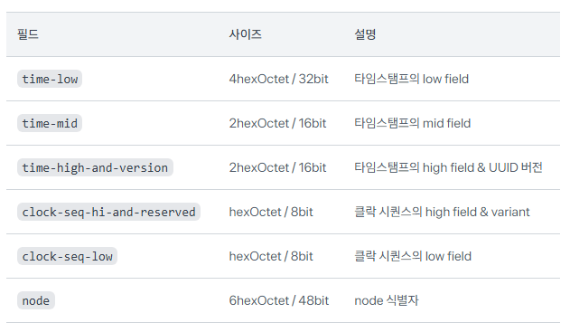
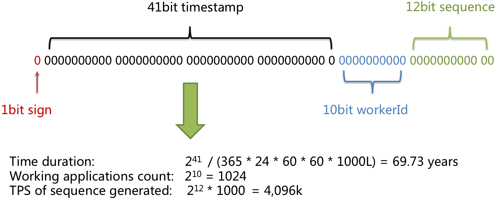

# UUID는 최선인가?

## 왜  이 주제를 골랐는가?

### ID

- 유일한 ID를 만들어서 데이터를 관리할 일이 다수 생김
    - ex) DB에 저장할 때의 PK
        - 고유값 보장
        - 인덱스 생성 시 활용
    - 어떻게 부여하는 것이 좋은가?에 대한 고민 필요.
- 여러분은 어떻게 ID를 부여하나요?
    - 가장 대표적인 예시 - auto_increment

### auto_increment (Ticket Server)

- 다수의 DBMS에서 사용함
- ID 자동 생성 기능
- 순서가 보장됨
    - 그러나.. 놀랍게도 스토리지 엔진 별로 다르게 동작함(과거)
    - (auto Increment의 lock 모드 관련 - 추가예정)
- 장점
    - 쉽다!
    - 자동 최적화가 된다
- 단점
    - 1대의 DB 서버를 기준으로 작동
        - 클러스터 구성 시 마스터 노드 기준 작업
        - 스케일 아웃 시 어려움이 있음
    - ID 생성이 DB에 의존한다
        - Insert 이후에야 PK를 알 수 있다
            - 이전에는 알 수 없다!

## 분산 시스템에서의 ID 생성이 필요하다

### UUID

- 개념
    - 네트워크 상에서 중복되지 않는 ID를 만들기 위한 규약
    - Universally Unique Identifier
    - 128-bit의 고유 식별자
- 장점
    - 중앙 시스템에 등록하고 발급하는 과정이 없음
    - 상대적으로 빠르고 간단함
    - 정렬, 차수, 해싱 등 다양한 알고리즘에 사용하기 쉬움
    - 보관이 용이함(?)
- 단점
    - 완전히 고유하지 않을 확률 존재
        - RFC 4122 문서에 따르면 UUID v4는 1조 개의 UUID 중 중복이 일어날 확률은 10억 분의 1
    - 사이즈가 숫자 등 다른 ID에 비해 큼
    - indexing 등을 할 때 성능에 영향을 미칠 수 있음. (크기 때문)
    - 사용자들이 직접 사용하기 어려움 (지나치게 길어서)
        - url / 보안키로 사용 시

- 구조
    - 총 길이 36자리 / 128-bit의 숫자 문자열
    - 32개의 16진수 숫자가 4개의 하이픈으로 나뉘어짐
        - 8-4-4-4-12
            
            
            
    - 필드
        
        
        
- 버전
    - UUID는 5개의 버전이 존재함.
    
    - **UUID version 1 (Time-Based)**
        
        
        
        - node → MAC address of the host(usually)
            - 노드 식별자임
        - node 식별자에 기반해 유니크한 값 생성 가능
        - Mac Address 포함하는 것은 privacy concern요소
        - 예측 가능함 → 시간과 Mac address를 알면 유추 가능하다
    - **UUID version 2 (DCE Security) * 분산 보안**
        
        
        
        - 시간 기반 필드가 줄어듦
        - Variant (RFC)
            - UUID의 규칙 (RFC 4122)
                - RFC - 미국 국제 인터넷 표준화 기구에서 제공하는 문서
            - Local Domain & Local ID
            - Clock Sequence
    - 버전별 특징 추가 정리 예정

### Snowflake ID

- UUID는 어쨋든 한계를 지님
    - 분산 컴퓨팅 환경에서 많은 트래픽 처리를 위해 더 효율적인 ID 필요함
    - 트위터(X)에서 고안한 ID
- 64bit 고유 식별자
    - 분산 환경을 목적으로 함
    - Tweets, Direct Messages, List
- 구현 방식
    
    
    
    - `Epoch timestamp in millisecond`  : 41bits
        - Epoch : 기원 시간 → 시작 지점 설정
        - 기원 시간 이후 몇 밀리초 경과했는지
        - 69년의 기간 표기 가능
    - `Configured machine/node/shard Id` : 10bit
        - 기기/노드/샤드 Id 할당
        - 주로 프로세스가 일어나는 환경 - 분산 환경의 각각 노드라던가..를 등록
    - `sequence` : 12bit
        - local counter per machine
        - 4096개 표기 가능
        - 하나의 환경에서 카운트
    - extra 1bit → 음양수 구분 -큰 의미 x
- 장점
    - 시간이 가장 먼저 표기 → 시간 기준으로 sort하기 편함
    - 고가용성 - 오랫동안 쓸 수 있다
- 사용처
    - discord 사에서 해당 id 사용
    - instagram에서는 자체적인 수정된 버전으로 사용 중
        - sequence가 10bit, shardID가 13bit
- 단점
    - TimeStamp 기반(중요)
        - OS나 인스턴스별 시간에 유의해야
        - 서버 시간을 기준으로 생성한다,는 개념이나 다를 수 있어 확인 필요
    - 중앙 관리를 위해서는 Apache ZooKeepr가 필요함
        - 복잡성 증대

### MongoDB ObjectID

- 개념
    - MongoDB에서 사용할 수 있는 ObjectId
    - 비슷한 원리로 Id 자동 생성
- 구조
    
    > 
    > 
    > - Unix epoch 이후 초 단위로 측정된 ObjectId 생성을 나타내는 4바이트 타임스탬프입니다.
    > - 프로세스당 한 번씩 생성되는 임의의 5바이트 값입니다. 이 임의의 값은 머신과 프로세스마다 고유합니다.
    > - 임의의 값으로 초기화되는 3바이트 증분 카운터입니다.
    - 메소드
        - `ObjectId.getTimestamp()` : 날짜 반환
        - `ObjectId.toString()` : 16진수 문자열로 반환
    - 이진직렬화 되어 저장 (BSON)
        - 사실 ObjectId는 BSON의 데이터타입 스펙 중 하나
- 장점
    - indexing이 더 효과적이다
    - 짧고 성능에 좋다
- 단점?
    - MongoDB는 UUID도 지원하고 있음(생성해줌)
        - 국제적인 통용성이 떨어지는 ObjectID보다 UUID가 나을 수도 있음.

## 결론

### uuid만이 정답이 아니다!

- 성능의 문제
    - 성능 문제가 발생하는 이유
    - 신규 버전을 사용해야 하는 이유
- 사용자 친화적인 길이의 문제
    - 링크 등을 만들 때
    - 보안 키를 생성할 때
    
    ⇒ 다른 Id를 생성하는 방식을 고민해볼 수 있다
    
- 대부분 TimeStamp를 기반으로 고유 식별자를 형성한다
    - 어떻게 할당하고 어떻게 인덱싱 할 것인가 고려가 필요하다
    - 스스로 구현해보는 것도 좋을 것

---

https://jinseong-dev.tistory.com/21

https://openlife.tistory.com/355

https://velog.io/@inhwa1025/MySQL-autoincrement-locking-%EC%84%A4%EC%A0%95-t2dj0741

https://keepgoing0328.tistory.com/entry/MySQL-autoincrement%EC%99%80-innodbautoinclockmode

https://kotlinworld.com/417

https://stackoverflow.com/questions/28895067/using-uuids-instead-of-objectids-in-mongodb

https://www.mparticle.com/blog/what-is-a-uuid/

https://docs.tosspayments.com/resources/glossary/uuid

https://datatracker.ietf.org/doc/html/rfc4122

https://www.uuidtools.com/uuid-versions-explained

https://medium.com/tuanhdotnet/facts-about-uuid-versions-which-version-should-you-use-and-why-2127e01f8ea2

https://apoorvtyagi.tech/generating-unique-ids-in-a-large-scale-distributed-environment

https://github.com/twitter-archive/snowflake/tree/snowflake-2010

https://tech-monster.tistory.com/228

https://instagram-engineering.com/sharding-ids-at-instagram-1cf5a71e5a5c

https://code.flickr.net/2010/02/08/ticket-servers-distributed-unique-primary-keys-on-the-cheap/

https://www.mongodb.com/ko-kr/docs/manual/reference/method/ObjectId/

https://www.mongodb.com/developer/products/mongodb/bson-data-types-objectid/

https://medium.com/@wonjerry24/mongodb-objectid%EB%8A%94-%EC%9C%A0%EC%9D%BC%EC%84%B1%EC%9D%84-%EB%B3%B4%EC%9E%A5%ED%95%A0%EA%B9%8C-788a3b0c3554

https://bsonspec.org/

https://happy-coding-day.tistory.com/247

https://stackoverflow.com/questions/28895067/using-uuids-instead-of-objectids-in-mongodb